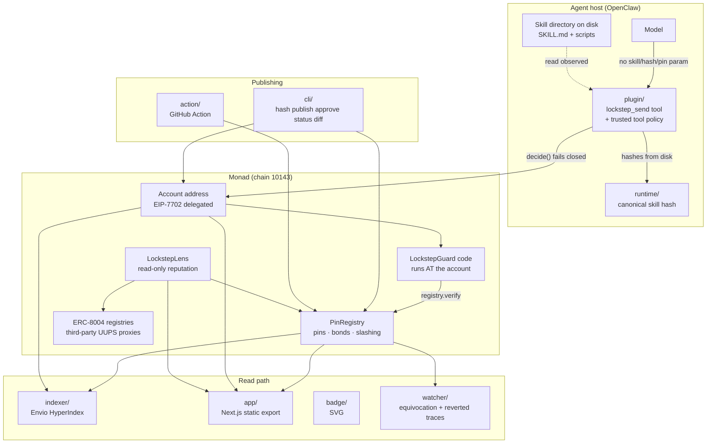

# MASTER_AI_CONTEXT

Canonical context document for AI systems working on this repository.

**Status legend used throughout:** `IMPLEMENTED` · `PARTIAL` · `PLANNED` · `IDEA` · `UNKNOWN` · `INFERRED` · `EXPERIMENTAL` · `DEPRECATED` · `KNOWN ISSUE` · `TEMPORARY`

Every factual claim below was read out of the repository. Where a claim is derived rather than stated, it is marked `[INFERRED]`. Where the repository does not answer, it is marked `[UNKNOWN]` rather than guessed.

**Verification basis for this document:** `forge test` run and observed (**187 tests / 14 suites / exit 0**), `npm run test:unit` run and observed (678 tests / 7 workspaces / exit 0), `npm run typecheck` (8 workspaces / exit 0), `npm run verify:dashboard` (export gate passed), `git ls-files` enumerated (234 tracked files at first pass). Test counts, gas figures, design tokens and addresses in this document are transcribed from those runs and from source, not recalled.

**A confirmed privilege escalation was found and fixed during this document's lifetime.** An authorised executor could change account policy by routing `authorizeExecutor` or `approvePin` through `execute`, because a call made *from* the account *to* the account satisfies `onlySelf`. `execute` now refuses the account as a call target. See §5.2, §5.4, §17 and §23. Any statement below about the guard's guarantees reflects the fixed contract.

---

## 1. Project identity

| Field | Value |
|---|---|
| Name | Lockstep |
| Root package | `lockstep`, version `0.0.1`, `private: true`, MIT |
| One-line description (from `package.json`) | "A lockfile for agent money. Skill provenance enforced on-chain at settlement." |
| Repository | `github.com/faizydroid/lockstep` (public) |
| Type | npm workspaces monorepo + Foundry contracts + Envio indexer + Next.js static export |
| Target chain | Monad testnet, chain id `10143`. Mainnet `143` is supported in code paths but not deployed |
| Purpose of the build | Hackathon submission, Monad Metropolis Track 04, deadline 11 October 2026 |
| Node requirement | `>=22.18.0` (root `engines`) |
| Package manager | npm (root `package-lock.json`); the indexer has its own lockfile and is **not** a workspace member |

### Workspaces (root `package.json`)

`runtime`, `plugin`, `cli`, `watcher`, `action`, `sandbox`, `badge`, `app`, `e2e`.

Note `contracts` and `indexer` are deliberately **not** workspace members. The indexer's exclusion is load-bearing — see §12.

---

## 2. Product purpose and the problem

### The problem, as the repository states it

An AI agent loads a "skill" — a directory containing `SKILL.md` plus scripts — and acts on it. Skills are mutable: a publisher ships version 1.0.0, users approve it, then the publisher (or an attacker who compromised them) silently replaces the bytes while keeping the version string. Anything that trusted "kuru-quote 1.0.0" now runs different code with the same authority.

### The gap Lockstep claims to occupy

The repository is precise, and repeatedly self-correcting, about the boundary against MetaMask's Delegation Toolkit ("Gator"):

- `gator grant --scope functionCall` caveats a delegation by `--targets`, `--selectors`, `--valueLte`.
- Those are exactly the three things a Lockstep pin declares. **The two systems agree completely about *what* an agent may call.**
- The difference is *which code* made the call. `redeemDelegation(delegation, target, value, callData)` has nowhere to put the identity of the code that built `callData`. `execute(pinId, skillHash, calls)` does.

From `integrations/metamask/README.md`: "The gap is in the signature, not the enforcement, so it cannot be closed by writing a cleverer caveat." This is proved by `contracts/test/GatorComparison.t.sol` (12 tests, verified passing), which models the three real caveat enforcers and shows a poisoned update redeeming cleanly through all of them while Lockstep refuses the identical calldata.

The complementary framing is stated in `PinRegistry.sol`: "This contract bounds *which code may call which functions*. It does not bound amounts, because amount limits belong with the wallet that holds the funds — MetaMask Agent Wallet already does spend limits well. The two compose; neither subsumes the other. **Do not add token-amount parsing here.**"

### Target users and roles

Three roles, evidenced by `app/src/lib/settings.ts` (`PROFILE_ROLES`), the CLI's own usage text, and `app/src/app/start/profile/page.tsx`:

| Role | What they do | Primary surfaces |
|---|---|---|
| **Publisher** | Pins an exact skill version, declares capabilities, posts a bond | `lockstep hash`, `lockstep publish`, the GitHub Action, `/bonds`, `/badge` |
| **Account owner** | Approves specific pinned versions, authorises executors, revokes | `lockstep approve`, `lockstep status`, `lockstep diff`, `/approvals`, `/account`, `/drift` |
| **Challenger / watcher** | Detects equivocation and submits proof for a reward | `watcher/`, `/publishers` (challenge button) |

`[INFERRED]` A fourth implicit audience is a hackathon judge; `SUBMISSION.md` is written explicitly for one.

### Maturity

`PARTIAL` overall. Contracts, off-chain packages, CLI, dashboard, Action and indexer config are implemented and tested. The live testnet deployment now matches the current contracts and has separated identities plus recorded success/refusal evidence. Not on mainnet. Indexer not hosted. No third-party publisher has pinned a skill. See §17.

---

## 3. Core mechanism (the thing to understand first)

Four commitments, in order:

1. **Canonical skill hash** (`runtime/src/canonical.ts`, scheme `lockstep-skill-hash/v2`). A directory tree hashes to one `bytes32`. Changing any byte changes the hash.
2. **A pin** (`PinRegistry.publish`). A publisher commits `(name, version, skillHash, capabilities[], maxValuePerBatch)` on chain and locks a bond priced by declared blast radius. `pinId = keccak256(abi.encode(publisher, skillHash))`.
3. **An approval** (`LockstepGuard.approvePin`, `onlySelf`). The account owner approves a specific `pinId`. Because the pin id commits to the hash, a silent byte change cannot inherit the approval.
4. **Settlement enforcement** (`LockstepGuard.execute`). Every fund-moving batch is checked against the approved pin, on chain, before anything executes.

Plus one economic layer:

5. **Equivocation slashing** (`PinRegistry.slashEquivocation`). If a publisher signs two conflicting claims about one `(name, version)`, anyone can prove it and take the bond.

### What is proven vs attested — read before changing the guard

This distinction is stated in `LockstepGuard.sol`'s header and repeated in `README.md`, `SUBMISSION.md` and `FINDINGS.md §3`. It is the project's central honesty claim.

**Trustlessly verified from calldata, regardless of what any off-chain component says:**
- the target is on the pin's allowlist
- the selector is on the pin's allowlist
- the batch's **total** native value is within the pin's ceiling
- the batch holds at most `MAX_CALLS` (32) calls
- the pin is one the account holder explicitly approved
- the pin has not been revoked by its publisher
- no call in the batch targets the account itself, so a batch cannot reach the guard's own policy setters (added after a confirmed escalation — see §23)

**Attested, not proven:** which skill actually produced the call. The runtime computes the hash off chain and reports it. A compromised runtime can report an honest hash while executing something else. What the chain provides is a non-repudiable record binding the transaction to a claimed version — turning a false claim into provable fraud against a bond. **This is an economic guarantee, not a cryptographic one.**

**Out of scope entirely:** indirect prompt injection from content the agent reads, and any harm that does not move funds. "This contract bounds financial blast radius. It is not a general agent sandbox."

### The structural constraint that shapes the whole design

From `LockstepGuard.sol`: EIP-7702 adds code to an EOA but **does not intercept transactions signed by that EOA's own key**. Therefore **the agent must never hold the account's root key.** The account splits into:

- **the account** — user-controlled key, holds the funds, is the EIP-7702-delegated address
- **executors** — the agent's own addresses, authorised in the guard's storage, hold no funds, pay their own gas

An executor can only move value by calling `execute` on the account. This is recorded in `FINDINGS.md §2` as a design flaw that was found and corrected, not as an original insight.

---

## 4. Architecture map



### Data-flow trace: a guarded transaction, end to end

```
model calls lockstep_send { to, value, data }        ← no skill, hash or pin parameter exists
  → plugin resolves provenance from SKILL.md files actually read this run
      (SkillProvenanceTracker, plugin/src/activeSkill.ts)
  → plugin/src/policy.ts decide():
        no-skill      → block NO_SKILL_PROVENANCE
        ambiguous     → block AMBIGUOUS_PROVENANCE
        outside roots → block SKILL_OUTSIDE_ROOTS
        hash throws   → block HASH_FAILED
        no pin        → block NOT_PINNED
        else          → allow { pinId, skillHash, skillRoot }
  → chain adapter submits execute(pinId, attestedSkillHash, calls) from the EXECUTOR key
  → LockstepGuard.execute, running at the ACCOUNT address:
        msg.sender is self or authorised executor  else NotAuthorizedExecutor
        calls.length in 1..32                      else EmptyBatch / TooManyCalls
        approvedPin[pinId]                         else PinNotApproved
        registry.verify(pinId, target0, selector0) → (pinnedHash, ceiling, firstAllowed)
        pinnedHash == attested && pinnedHash != 0  else SkillHashMismatch(attested, pinned)
        sum(values) <= ceiling  (checked BEFORE any call, checked arithmetic)
                                                   else BatchValueExceedsCeiling(total, ceiling)
        per call: allowed(target, selector)         else CapabilityNotDeclared(target, selector)
        target.call{value}(data); bubble revert     else CallReverted(index)
  → emit SkillExecuted(pinId, skillHash, executor, callCount)
```

**Where decisions are actually made:**

| Decision | Location |
|---|---|
| Off-chain allow/block, fails closed | `plugin/src/policy.ts` → `decide()` |
| Provenance resolution | `plugin/src/activeSkill.ts` → `SkillProvenanceTracker` |
| Skill hashing | `runtime/src/canonical.ts` → `hashSkill()` |
| On-chain authorisation | `LockstepGuard.execute` + `onlySelf` modifier |
| Capability + hash + value check | `LockstepGuard.execute`, via `PinRegistry.verify` / `isAllowed` |
| Bond pricing | `PinRegistry.quoteBond` |
| Slashing adjudication | `PinRegistry.slashEquivocation` |
| Reviewer eligibility | `LockstepLens.isGuardedAccount` + `isEligibleReviewer` |
| Browser write permission | `app/src/lib/policy.ts` → `WRITE_RULES` (enforced by `writes.ts` + ABI + export check) |
| Dashboard config | `app/src/lib/chain.ts` → `readConfig()` |
| Shipped-artifact gate | `scripts/check-export.mjs` |

---

## 5. Contracts (`contracts/`)

Foundry. `solc 0.8.28`, optimizer on, `optimizer_runs = 200`, `deny = "warnings"` (compiler warnings are fatal — "The guard sits in the signing path of funded accounts"). Fuzz `runs = 512`. Invariant `runs = 128`, `depth = 32`. `forge-std` is a git submodule (`contracts/lib/forge-std`) — **CI must check out with `submodules: recursive` or contracts do not compile.**

`foundry.toml` carries a long `[lint] exclude_lints` list. Each exclusion has a written justification against actual call sites. Do not delete these without reading them — several describe intended design (`require-revert-in-loop`, `calls-loop`, `arbitrary-send-eth`, `reentrancy-events`, `missing-inheritance`).

### 5.1 `PinRegistry.sol` (36 KB) — IMPLEMENTED

The publisher-side registry. Holds pins, bonds, capability sets, and the single slashing condition.

**`struct Pin`:** `publisher`, `skillHash`, `versionId`, `maxValuePerBatch`, `requiredBond`, `capabilityCount` (u32), `highRiskCount` (u32), `publishedAt` (u64), `revokedAt` (u64), `exists`, `slashed`.

**`struct PublishParams`** (calldata struct — `name`, `version`, `skillHash`, `maxValuePerBatch`, `targets[]`, `selectors[]`). It is a struct for a mechanical reason recorded in the source: the flat six-parameter form kept ten stack slots live and hit "stack too deep" assembling the `Published` payload. `viaIR` was rejected because it changes every recorded gas figure. **Do not flatten this back.**

**Immutables:** `bondAsset`, `baseBond`, `perCapabilityBond`, `highRiskBond`, `nativeValueBond`, `unbondingDelay`, `challengerRewardBps`, `slashRecipient`.

**Storage:** `_pins`, `_allowed[pinId][capabilityKey]`, `bondBalance`, `lockedBond`, `isHighRiskSelector`, `versionPinCount[publisher][versionId]`, `bondReclaimed`.

**Constants:** `MAX_CAPABILITIES = 64`, `MAX_LABEL_BYTES = 64`.

**Identity derivation:**
- `computePinId(publisher, skillHash) = keccak256(abi.encode(publisher, skillHash))` — scoped by publisher so publisher A cannot ride approvals earned by publisher B
- `computeVersionId(name, version) = keccak256(abi.encode(name, version))` — `abi.encode` not concat, so `("ab","c")` and `("a","bc")` cannot collide
- `capabilityKey(target, selector) = keccak256(abi.encodePacked(target, selector))`

**Bond pricing** (`quoteBond(capabilityCount, highRiskCount, movesNativeValue)`):
```
baseBond
  + perCapabilityBond * capabilityCount
  + highRiskBond      * highRiskCount
  + (movesNativeValue ? nativeValueBond : 0)
```
Deployed parameters (`contracts/script/Deploy.s.sol`, 6-decimal units, `ONE = 1e6`):

| Parameter | Value |
|---|---|
| `BASE_BOND` | 100 × 1e6 |
| `PER_CAPABILITY_BOND` | 25 × 1e6 |
| `HIGH_RISK_BOND` | 500 × 1e6 |
| `NATIVE_VALUE_BOND` | 500 × 1e6 |
| `UNBONDING_DELAY` | 7 days |
| `CHALLENGER_REWARD_BPS` | 5,000 (50%) |

Pricing rationale, stated in source: an earlier design sized bonds against the native-value ceiling, which "is close to useless" because almost nothing interesting moves native value — a swap carries `value == 0` and moves tokens through an allowance. Pricing therefore keys on **breadth** (distinct target/selector pairs) and **severity** (how many are allowance- or transfer-granting). `nativeValueBond` is a **flat** charge, not a fraction of the ceiling, because bond is 6-decimal AUSD and the ceiling is 18-decimal wei — "scaling one by the other is dimensionally meaningless without a price oracle, and an earlier version that did so demanded ~1e19 AUSD units to pin a 10 MON ceiling."

**Label validation** (`_requireLabel`, `isValidLabel`): non-empty, ≤ 64 bytes, every byte in `0x21`–`0x7e` (printable ASCII, **no space**). This blocks homoglyph and trailing-space evasion (`"kuru-quote "`, Cyrillic `о`). Cost accepted explicitly: non-Latin skill names are refused. Unicode normalisation was rejected as "thousands of gas and a table this contract cannot carry."

**The version id is derived, never accepted.** This is documented as a fixed security defect: `publish` used to take `bytes32 versionId` unchecked, so a publisher could republish different bytes under an arbitrary version id and `slashEquivocation` would see no contradiction. "The rug pull this registry is built to price became unpriced, and the bond became decorative."

**Slashing (`slashEquivocation(pinIdA, pinIdB)`)** — the only slashing condition, permissionless. Requires: different pins, both exist, same publisher, **same `versionId`**, **different `skillHash`**. The later pin (`publishedAt >=`) is the guilty one. Effects: `slashed = true`, `versionPinCount -= 1`, both pins revoked, `lockedBond`/`bondBalance` reduced, `reward = amount * challengerRewardBps / 10_000` to `msg.sender`, remainder to `slashRecipient`.

**The honest penalty is half the bond, and the source says so.** Because challenging is permissionless, the offender can challenge themselves from a fresh EOA and collect the reward. Effective penalty is `requiredBond * (10_000 - challengerRewardBps) / 10_000`. A `msg.sender != publisher` check was considered and rejected: "a fresh EOA defeats that in one transaction, and a check which looks like a protection but is not is worse than no check." Verified by `test_selfReportingCostsOnlyTheSlashRecipientShare`.

**`versionPinCount` counts *unresolved* claims, not publishes.** It used to count publishes and never decrement, which stranded bonds with no beneficiary — including the *surviving honest* pin's bond after a successful challenge. "A frozen-with-no-beneficiary bond is strictly worse than a slashed one. Slashing at least pays someone." Decrementing on slash is also the escape hatch for an accidental non-reproducible rebuild: the publisher proves the contradiction against themselves, forfeits the later claim, recovers the rest.

**Reads:** `isAllowed` (single SLOAD hot path), `getPin`, `liveSkillHash` (zero if unknown or revoked), and `verify(pinId, target, selector) → (liveHash, maxValuePerBatch, allowed)`. `verify` exists purely for hot-path gas — folding three separate CALLs "cut roughly 9.5k gas per transaction."

**Events:** `BondDeposited`, `BondWithdrawn`, `BondLocked`, `BondReclaimed`, `Published`, `CapabilityDeclared`, `Revoked`, `Slashed`.

`Published` records `name` and `version` as strings, not just `versionId`. Reason in source: without the preimage an indexer can only render a hash, and equivocation — a claim about a name and version — is "unreadable if the chain only holds the digest of the pair." Cost ≈ 1 kilogas on a once-per-release path.

**Errors (24):** `AlreadyPublished`, `AlreadyRevoked`, `BondTransferFailed`, `DuplicateCapability`, `EmptyCapabilities`, `InsufficientUnlockedBond`, `LengthMismatch`, `NotPublisher`, `NothingToReclaim`, `EquivocationUnresolved`, `NoEquivocation`, `NotSamePublisher`, `PinAlreadySlashed`, `PinNotRevoked`, `PinUnknown`, `RewardShareTooHigh`, `SamePin`, `SameSkillHash`, `ZeroSlashRecipient`, `TooManyCapabilities`, `UnbondingNotElapsed`, `ZeroAmount`, `ZeroSkillHash`, `ZeroTarget`, `LabelEmpty`, `LabelTooLong`, `LabelNotPrintableAscii`.

### 5.2 `LockstepGuard.sol` (15 KB) — IMPLEMENTED

EIP-7702 delegate. Its code runs **at the account's address**, not at a contract someone deployed. This single fact drives most of the surrounding design.

**ERC-7201 namespaced storage**, `@custom:storage-location erc7201:lockstep.guard.v1`:
```
GUARD_STORAGE_SLOT = 0x723bc0536d6998736ca58b10278e77528d6552c6336394144a42647181e0f200
                   = keccak256(abi.encode(uint256(keccak256("lockstep.guard.v1")) - 1)) & ~0xff
struct GuardStorage { mapping(bytes32=>bool) approvedPin; mapping(address=>bool) authorizedExecutor; }
```
Namespacing exists because under 7702 the delegate writes into the *account's* storage; naive sequential slots would let a different implementation "silently reinterpret another's state — here, potentially reading an attacker-controlled slot as an approval."

`GuardStorage` **deliberately holds no counters.** An execution counter cost ~3k gas of SSTORE on every agent transaction to serve a view `SkillExecuted` already gives indexers free.

**`MAX_CALLS = 32`.** The source is explicit that this does *not* bound token drain (allowance transfers carry `value == 0`); what it buys is a predictable batch cost, a meaningful `callCount` receipt, and no unbounded caller-controlled loop of external calls in a funded account's signing path.

**`guardStorageSlot()`** is exposed for indexers and wallet UIs — and carries the project's sharpest caveat: **a storage read alone is not evidence an account is protected.** Delegation replaces *code*, not *storage*, and an account carries exactly one delegation designator. Re-delegating away from this guard (which `gator create` does) leaves every approval sitting untouched in the slot with nothing enforcing them. Any consumer must also check the account's code equals `0xef0100 || address(this)`. Established by `Eip7702ExclusivityTest`, not by inspection.

**`onlySelf`** — `msg.sender == address(this)`. Under 7702 that is exactly one caller: a transaction the account holder signed to their own address. Executors deliberately cannot change policy; "an agent must never be able to widen its own permissions." Gates `approvePin`, `unapprovePin`, `authorizeExecutor`, `revokeExecutor`. Deliberately not extracted into an internal function (with a `forge-lint` suppression and a written reason).

**Value ceiling is per batch, summed before execution.** This is a documented fixed defect: the check used to be per call with nothing bounding batch length, so "a pin with a 1 MON ceiling authorised 1 MON, or 100 MON as a hundred calls." Checked before the first call for two stated reasons — an over-budget batch costs only the calldata scan, and no value has moved when the budget is decided. **Checked arithmetic is load-bearing:** `unchecked` would let `type(uint256).max + 2` sum to 1 and pass under the ceiling (`test_theValueTotalCannotBeWrappedAroundTheCeiling`).

Error renamed `ValueExceedsCeiling` → **`BatchValueExceedsCeiling(total, ceiling)`** so decoded reverts stop claiming a per-call violation.

**There is deliberately no `RugPullBlocked` event.** An earlier version emitted one immediately before reverting: the revert rolls the log back so no indexer ever receives it, and the dead emit made rejection cost *more* than success. `SkillHashMismatch(attested, pinned)` carries both values in the revert reason, which survives in the trace. **The watcher reads blocked attempts from reverted-transaction traces, not logs.** This propagates to `indexer/schema.graphql` (no `BlockedAttempt` entity) and to `VIDEO.md`.

**Events:** `PinApproved`, `PinUnapproved`, `ExecutorAuthorized`, `ExecutorRevoked`, `SkillExecuted(pinId, skillHash, executor, callCount)`.

**Errors:** `NotSelf`, `NotAuthorizedExecutor`, `PinNotApproved`, `SkillHashMismatch`, `CapabilityNotDeclared`, `BatchValueExceedsCeiling`, `EmptyBatch`, `TooManyCalls`, `CallReverted`, **`SelfCallRefused(uint256 index)`**.

**`execute` refuses the account as a call target**, for every call, in the same pre-flight pass that sums values — so before anything executes. This closed a confirmed escalation: `onlySelf` requires `msg.sender == address(this)`, and `execute` makes its calls *from* the account, so a call whose target *is* the account satisfied it. An authorised executor could route `authorizeExecutor(attacker)` or `approvePin(anything)` through a batch and change policy with no owner signature. It required an approved pin declaring `(accountAddress, policySelector)`, so it was targeted rather than broadly exploitable — and it was reachable while the contract's own documentation said it was not. **Every** self-target is refused rather than a blacklist of the four policy selectors, so a function added later cannot reopen it. Cost: 320 gas per call. Proven and regression-tested in `contracts/test/SelfCallEscalation.t.sol` (12 tests).

Empty calldata maps to selector `0x00000000`, which a pin must declare explicitly — fail closed, so a pin declaring only contract calls cannot drain via a plain send. `receive() external payable {}` exists.

**No reentrancy guard, deliberately.** Nesting batches requires a target to re-enter `execute`, which requires it to be an authorised executor — a state the owner created deliberately, in which they already granted an arbitrary contract spending rights. "A reentrancy guard would put an SSTORE in the hot path of every honest transaction to change nothing about that position."

### 5.3 `LockstepLens.sol` (15 KB) — IMPLEMENTED (with a stated limitation)

Pure reader. Provides the curated client set ERC-8004 requires but does not supply. Holds no funds and grants no authority; **the enforcement path never consults it.**

Rationale: ERC-8004's Reputation Registry lets anyone call `giveFeedback`, and `getSummary` *requires* a non-empty `clientAddresses` because unfiltered aggregation is spam-vulnerable by the spec's own admission. "So the standard demands a curated client set and does not provide one."

**Eligibility = two checks:**
1. `isGuardedAccount(account)` — `account.codehash == keccak256(0xef0100 || guard)`
2. through that guard, the candidate approves ≥ 1 **live** pin of the publisher under review

**Check 1 is a documented fixed defect.** Eligibility used to be decided by staticcalling `isPinApproved` and believing the answer. "Any address can implement it, and returning `true` unconditionally is a contract small enough to deploy for pocket change and clone to as many addresses as an attacker wants." The test suite missed it because every Sybil in it was a bare EOA. `EXTCODEHASH` is used rather than byte comparison for two reasons: one opcode, and a candidate list is untrusted input — comparing bytes would let a caller point 256 slots at 24 kB contracts and force ~6 MB of memory expansion in a view UIs call every render.

**Honest bound, stated in source:** a forged reviewer now costs a distinct EOA, a signed 7702 authorisation, and one `approvePin` write. "That is real and it is per-reviewer, but it is a few tens of thousands of gas — not a bond. A funded attacker can still manufacture reviewers; they can no longer do it with one contract and a loop."

**`weightedScore` is NOT exposure-weighted.** True exposure weighting needs a per-(account, pin) execution record, which would put a cross-contract SSTORE in the guard's hot path. Deferred deliberately. Source instruction: **"Do not describe this as exposure-weighted."**

**Constants/immutables:** `pins`, `identity`, `reputation`, `guard`, `_guardDesignatorHash`, `DESIGNATOR_LENGTH = 23`, `MAX_CANDIDATES = 256`. `guard` is immutable and singular on purpose: "If this were a set, or settable, the question 'is this account guarded' would have an answer that depends on who last changed the answer. A new guard implementation means a new lens."

**Declared trust assumption:** both ERC-8004 registries are UUPS (ERC-1967) proxies, implementation slot `0x360894a13ba1a3210667c828492db98dca3e2076cc3735a920a3ca505d382bbc`, admin slot zero, `UPGRADE_INTERFACE_VERSION() = "5.0.0"`, and at time of writing both return the **same** `owner()`, which has no code — one EOA can replace the implementation behind each. Measured on chain 10143, not read from documentation. "A project whose thesis is that code identity should be pinned reads its reputation input from a contract whose code can be replaced by one key."

**Functions:** `isGuardedAccount`, `isEligibleReviewer`, `eligibleReviewers` (dedupes, skips zero, bounded), `weightedScore`, `unfilteredScore` ("Never use this as a trust signal" — exists so a UI can show both numbers side by side), `publisherOf`.

### 5.4 `HighRiskSelectors.sol` — IMPLEMENTED

Library returning **14** selectors priced at a premium. Derived from an `IRiskySurface` interface **so the compiler computes them** rather than transcribing hex literals — "a mistyped selector here would silently under-price a dangerous capability."

Allowance grants: `approve`, `increaseAllowance`, `setApprovalForAll`, `permit`. Direct movement: `transfer`, `transferFrom`, `safeTransferFrom` (both overloads, via `keccak256` because Solidity cannot take `.selector` on an overload). Authority relocation: `delegate`, `upgradeTo`, `upgradeToAndCall`. Plus `bytes4(0)` — bare native send, "cheap to declare, and the most direct drain there is."

These are **not banned**; declaring them just costs more bond.

### 5.5 Other contract files

| File | Role |
|---|---|
| `src/interfaces/IERC20.sol` | Minimal ERC-20 |
| `src/interfaces/IERC8004.sol` | `IIdentityRegistry`, `IReputationRegistry` |
| `src/demo/DemoRouter.sol` | Demo target |
| `test/Fixtures.sol` | Shared harness (`deployCore`, `fundPublisher`, `singleCapability`, `defaultParams`, `ONE_AUSD`) |
| `test/mocks/MockERC20.sol` | Test token |
| `script/Deploy.s.sol` | Deploys registry + guard + optional lens. `MockBondAsset` (mAUSD, 6dp) defined here |
| `script/DeployLens.s.sol` (13 KB) | Lens deploy with on-chain validation of the ERC-8004 registries |

**`Deploy.s.sol` refuses a mock bond asset on chain 143:** `require(block.chainid != 143, "BOND_ASSET is required on Monad mainnet")` — "a registry whose bonds are worthless is worse than no registry: it advertises a guarantee it cannot pay." Bond parameters assume **6 decimals**; the source warns that switching to an 18-decimal token without rescaling makes every pin effectively free.

### 5.6 Contract test suites — 187 tests, 14 suites, all passing (verified by running `forge test`)

| Suite | Tests | Proves |
|---|---:|---|
| `LockstepGuard.t.sol:LockstepGuardTest` | 31 | Delegation installs code, ERC-7201 slot derivation, rug pull blocked both ways, executor cannot approve or self-authorise, batch/ceiling/inclusivity, revert bubbling, 3 fuzz properties |
| `Slashing.t.sol:SlashingTest` | 25 | Version-id determinism and collision resistance, all 7 label-validation rejections, slash mechanics, permissionless challenge, 1 fuzz |
| `Slashing.t.sol:EquivocationFreezeTest` | 11 | Bond freeze while a contradiction stands, survivor unfreezing on adjudication, self-resolution, 3-way equivocation |
| `PinRegistryBond.t.sol` | 28 | Deposit/withdraw/lock accounting, pricing monotonicity, sane AUSD ranges, all 12 high-risk selectors registered, revoke/reclaim lifecycle, 2 fuzz |
| `LockstepLens.t.sol` | 23 | `EXTCODEHASH` sees the designator not the implementation, lying stubs filtered, rival delegation rejected, Sybil spam moves the naive score and not the filtered one |
| `DeployLensChecks.t.sol` | 18 | Base64/tokenURI validation, `indexOf`, guard-belongs-to-registry checks, 2 fuzz |
| `Adversarial.t.sol` | 15 | Version-id independence, silent replacement slashable, confusable labels, forged reviewers, ceiling splitting, integer wraparound, revoke-and-run, accidental-rebuild recovery, outsider cannot freeze a bond |
| `SelfCallEscalation.t.sol` | 12 | **Regression suite for a confirmed privilege escalation.** Executor cannot reach `authorizeExecutor` or `approvePin` through `execute`; neither can the account holder; refused whatever the calldata and wherever it sits in the batch, reporting its index; nothing in the batch runs; ordinary and cross-account batches unaffected; check ordering pinned; policy setters now priced as high risk while the narrowing pair is not |
| `GatorComparison.t.sol:GatorComparisonTest` | 7 | Gator permits the poisoned call, Lockstep refuses identical calldata, caveats reject what they are for, "the difference is a parameter" |
| `GatorComparison.t.sol:Eip7702ExclusivityTest` | 5 | One delegation per account, moving it takes the guard with it, **approval survives in storage while unenforced**, namespaced storage survives a rival writing slot 0 |
| `AllowlistComparison.t.sol` | 5 | An allowlist wallet permits what Lockstep refuses |
| `GuardGas.t.sol` | 3 | Overhead, batch amortisation, rejection is cheap |
| `BondVelocity.t.sol` | 3 | Window durations, bond-velocity advantage, throughput worked example |
| `Invariants.t.sol:InvariantsTest` | 1 suite / **7 invariants** | See below |

**The 7 invariants** (forge counts the suite as 1 test; it ran 128 runs / 4096 calls / 10 reverts over `RegistryHandler.{deposit,publish,reclaim,revoke,slash}`):
`invariant_lockedNeverExceedsBalance`, `invariant_lockedEqualsSumOfLivePinBonds`, `invariant_registryHoldsWhatItOwes`, `invariant_bondIsNeverPaidTwice`, `invariant_livePinsAreFullyBonded`, `invariant_versionPinCountTracksUnslashedClaims`, `invariant_revokedPinsAreNeverLive`.

`FINDINGS.md §22` records that the invariant campaign "found a real bug, after failing twice to find anything" — the revoke-then-reclaim-then-slash path double-released locked bond.

### 5.7 Gas, measured (transcribed from the `forge test` run)

Local, warm, `execute` call only, excluding the 21,000 intrinsic cost:

| Measurement | Gas |
|---|---:|
| Unguarded direct call | 27,113 |
| Through Lockstep | 67,462 |
| **Enforcement overhead** | **40,349** |
| Guarded batch of 1 | 69,462 |
| Guarded batch of 5 | 83,113 |
| Marginal per extra call | 3,412 |
| Minimal rejection (auth failure, 1 SLOAD) | 28,196 |
| Cost to reject a rug pull | 43,263 |

Whole-transaction, on Monad testnet, cold, wrapping a real ERC-20 transfer (from `README.md` / `PLAN.md`):

| Measurement | Gas |
|---|---:|
| Guard-checked execution, 1-call batch | 115,207 |
| — of which `registry.verify` | 17,769 |
| — of which the token transfer | 39,822 |
| — guard's own logic | ~33,600 |
| Refusal on hash mismatch | 62,181 |
| EIP-7702 delegation + first `approvePin` | 57,896 |

**The two tables are different scopes, not competing numbers**, and `README.md` has a section titled "Reconciling the two gas tables" specifically because "a reader who spots the gap and gets no explanation is right to distrust every other number here." Both testnet figures **predate the current contracts.**

Guard-rails in the tests: `assertLt(overhead, 60_000)`, `assertLt(rejection, 50_000)`, `assertGt(rejection, minimal)`. The last one encodes the property that matters — refusing must cost less than executing, "otherwise blocking a rug pull becomes a griefing vector against whoever pays gas." `test_gas_rejectionIsCheap` uses a raw `.call` rather than `try/catch` because try/catch reserves 1/64 of gas and inflated an earlier measurement by ~40k.

`contracts/.gas-snapshot` (181 lines) is committed.

---

## 6. `runtime/` — canonical skill hashing (IMPLEMENTED)

The primitive everything else depends on. `SCHEME_ID = "lockstep-skill-hash/v2"`, and **the scheme id is inside every hash preimage** so a future policy change produces provably different hashes rather than silently reinterpreting old pins.

Two failure modes drive every decision, stated at the top of `canonical.ts`:
- **FALSE POSITIVE** — same logical skill hashes differently on two machines. "The user sees their agent blocked for no reason and turns Lockstep off. This is the product-killing failure."
- **FALSE NEGATIVE** — different content hashes identically. "This is the security-killing failure."

**Hash construction:**
```
DOMAIN_LEAF = 0x00, DOMAIN_ROOT = 0x01      (distinct so a leaf can never read as a root)

leaf  = keccak256( 0x00 || u32be(pathLen) || pathBytes || u8(executable) || contentBytes )
root  = keccak256( 0x01 || u32be(schemeLen) || schemeBytes || u32be(fileCount)
                   || for each file sorted by path BYTES: u32be(pathLen) || pathBytes || leafHash )
```
Path length prefixes are load-bearing: without them `("ab","c")` and `("a","bc")` produce the same preimage, letting an attacker move bytes between filename and body. The file count is committed so a truncated entry list cannot pass as complete. The executable byte sits between path and content so neither can absorb it.

**Normalisations (the narrowest set that removes false positives):**
- CRLF/CR → LF and UTF-8 BOM stripped, but **only** for a 30-entry extension allowlist (`NORMALISED_EXTENSIONS`: `.md .txt .js .mjs .cjs .ts .mts .cts .jsx .tsx .json .jsonc .yaml .yml .toml .py .sh .bash .zsh .sql .graphql .css .html .xml .csv .env .ini .cfg .sol .markdown`). An explicit allowlist rather than a text/binary heuristic "because heuristics are attack surface: an attacker who can steer a file into the 'text' branch could use normalisation to mask a difference."
- Operates on **bytes**, not decoded strings, so invalid UTF-8 passes through rather than becoming U+FFFD (which would be lossy and collide).
- Paths: backslashes → `/`, Unicode **NFC** (macOS stores NFD), traversal and absolute paths rejected.
- Ordering: `comparePathBytes` compares UTF-8 bytes — deliberately **not** `localeCompare` and not JS string comparison, "because a Python or Go implementation of this scheme must produce identical hashes."

**Exclusions — deliberately minimal.** `EXCLUDED_TOP_LEVEL = {".git"}` only. **`node_modules` IS hashed.** "Excluding it would let an attacker swap a transitive dependency without changing the skill hash, which is precisely the supply-chain attack Lockstep exists to stop. Publishers must therefore either vendor dependencies or ship a lockfile inside the skill directory. That is a real cost and it is the correct trade."

**The executable bit is hashed** (`chmod +x` changes what runs without changing a content byte). Windows filesystems cannot represent it, so `isExecutable` returns false there for every file and a skill with an executable script hashes differently on Windows than Linux. **This is why publishing runs in CI on Linux** — the Action is the sanctioned publishing path.

**Symlinks are rejected by default** (`SYMLINK_REJECTED`). Following one would cover content the publisher does not control; hashing the link path would say nothing about what executes. "Neither is acceptable, so a skill containing a symlink cannot be pinned."

**Error codes:** `EMPTY_SKILL`, `DUPLICATE_PATH`, `INVALID_PATH`, `SYMLINK_REJECTED`.

**Note on style:** `SkillHashError` declares and assigns `code` explicitly rather than using a constructor parameter property, because parameter properties emit assignment code and **Node's type stripping refuses the whole file** — these packages have no build step. The same comment appears in `watcher/src/index.ts`. Do not "tidy" these into parameter properties.

Files: `canonical.ts` (core, pure, no filesystem), `load.ts` (`loadSkillFiles`), `hashDirectory.ts`, `index.ts`. Fixture at `runtime/fixtures/kuru-quote/`. 41 tests across 2 files.

---

## 7. `plugin/` — OpenClaw integration (IMPLEMENTED)

`openclaw.plugin.json`: id `lockstep`, `activation.onStartup: true`, contributes tool `lockstep_send` and trusted tool policy `lockstep-exec-gate`. Config schema requires `registry`, `account`, `chainId` (enum 143/10143); optional `rpcUrl`, `executorPrivateKeyEnv` (default `LOCKSTEP_EXECUTOR_KEY`), `skillRoots`.

### Why the agent cannot forge provenance

**The tool exposed to the model has no `skillHash`, no `pinId`, and no `skill` parameter.** "The parameter does not exist, so there is nothing for a poisoned SKILL.md to instruct the model to fill in." Provenance comes from what the plugin observed the runtime read, and the hash is computed from disk.

Worst case for a lying model: being confined to the capability bounds of some *other* pin the user already approved. "It can never exceed a pin, and it can never act with no pin at all, because `decide()` fails closed on absent and ambiguous provenance."

### `decide()` — `plugin/src/policy.ts`

Pure, every dependency injected, testable without a Gateway, filesystem or chain. **No branch allows a call because something could not be determined.** Block codes: `NO_SKILL_PROVENANCE`, `AMBIGUOUS_PROVENANCE`, `SKILL_OUTSIDE_ROOTS`, `HASH_FAILED`, `NOT_PINNED`.

### The exec gate is explicitly NOT a security boundary

`TRANSACTION_SENDERS` regexes match `cast send`, `cast publish`, `mm tx|send|transfer|swap|bridge|perps|earn|predict`, `forge script --broadcast`. The source is blunt: "Shell-command pattern matching is trivially evadable: `c\"\"ast send`, `$(echo cast) send`, a renamed binary, or a wrapper script all slip past it, and no amount of regex tightening fixes that."

**The actual boundary is key custody.** The executor holds no funds. The gate exists to catch misconfiguration and give a clear error. It errs toward blocking (`echo cast send` is refused — "a harmless false positive; missing a real send would not be"). Also documented in `FINDINGS.md §10`.

### Host-contract details learned the hard way

- `registerTool` takes a **factory**, not a finished tool, verified against `openclaw@2026.8.2`. The host calls `execute(toolCallId, params, signal, onUpdate)` — **params arrive second, not first.** An earlier version passed a plain object with `handler(params, ctx)`; the plugin loaded, `plugins inspect` listed the tool, every check passed, and the tool was never callable ("plugin tool is malformed (lockstep): lockstep_send missing execute function").
- The host calls `register` **more than once** — three times in one observed Gateway start — and keys typed hooks by plugin id and hook name. So `sharedTracker` is process-wide; a per-registration tracker meant the surviving read hook and the bound tool belonged to different registrations. Tests may inject a tracker; **production must not.**
- OpenClaw treats a thrown or timed-out `before_tool_call` handler as fail-closed. "That is the behaviour we want, so this code does not swallow errors to keep an agent running."

Files: `index.ts` (17.9 KB wiring), `policy.ts`, `activeSkill.ts` (`SkillProvenanceTracker`, `expandHome`, `isInside`, `isSkillManifest`, `skillRootOf`), `chain.ts` (ChainAdapter), `abi.ts`, `plugin.ts`, `openclaw-sdk.d.ts`, `deposit-bond.mjs`. 55 tests in `test/policy.test.ts`.

---

## 8. `cli/` — the approval and publishing tool (IMPLEMENTED)

Five commands in one binary "deliberately so they cannot drift apart":

| Command | Audience | Requires | Notes |
|---|---|---|---|
| `hash <dir>` | anyone | nothing | "Reads nothing but disk." Prints hash to stdout, per-file breakdown to stderr |
| `publish <dir> --manifest <f> [--dry-run]` | publisher | `PUBLISHER_PRIVATE_KEY` | |
| `approve <dir> [--yes]` | owner | `ACCOUNT_PRIVATE_KEY` | Shows the capability diff first |
| `status [<dir>]` | owner | — | Approvals + whether each skill on disk still matches |
| `diff <dir>` | owner | — | Approved version vs disk |

Exit codes: `0` ok, `1` no command / runtime error, `2` usage error. Errors print the message, not a stack — "these are operator errors far more often than bugs, and a wall of stack frames buries the actionable line."

`approve` refuses if `ACCOUNT_PRIVATE_KEY` does not derive `ACCOUNT_ADDRESS`, "because approvals live in the account's own storage and the CLI refuses a mismatch rather than sending a transaction that cannot take effect" (`.env.example`).

Files: `index.ts`, `env.ts`, `abi.ts`, `manifest.ts`, `pins.ts`, `risk.ts`, `commands/{publish,approve,status,diff}.ts`. 48 tests (`diff.test.ts` 9, `manifest.test.ts` 39).

### Manifest format (`lockstep.json`)

```json
{
  "schema": "lockstep/1",
  "name": "kuru-quote",
  "version": "1.0.0",
  "capabilities": {
    "onchain": {
      "calls": [{ "target": "0x…", "selector": "swap(uint256)" }],
      "maxValuePerBatch": "0"
    }
  }
}
```
Selectors are written as human-readable signatures and derived, not transcribed. The hostile fixture (`demo/attack/kuru-quote-hostile/`) is the same name at version `1.0.1` with an added `approve(address,uint256)` capability — the widening the Action is designed to turn red.

---

## 9. `action/` — GitHub Action (IMPLEMENTED, not on Marketplace)

`action.yml`: `using: node24`, `main: dist/index.js`.

**`node24` is date-critical, not cosmetic.** Recorded in the file: Node 20 reached EOL April 2026, GitHub began forcing JavaScript actions onto Node 24 by default 2 June 2026, and **Node 20 is removed from the runners on 16 September 2026** — before the submission deadline. The action previously declared `node20`.

**Inputs:** `skill-dir` (required), `rpc-url` (default `https://testnet-rpc.monad.xyz`), `chain-id` (default `10143`), `pin-registry` (required), `publisher-private-key`, `dry-run` (default `false`), `fail-on-capability-change` (default `true`).

**Outputs:** `skill-hash`, `version-id`, `pin-id`, `bond-required`.

**The Action's value is two refusals** (per `e2e/test/action.test.ts`): it will not publish a second conflicting claim about one version (which would be self-slashing), and it fails the job when a manifest widens capability.

**`dist/index.js` (728 KB) is committed deliberately** — "A published action is fetched and executed without an install step, so `dist/index.js` has to be in the tree. That is the one place in this project where a build artifact belongs in version control."

**Marketplace is structurally impossible from here:** the Marketplace requires exactly one action per repository with metadata at the repository **root**. This is a monorepo with metadata at `action/action.yml`. But **the Action is fully usable today** as `faizydroid/lockstep/action@v0.1.1` — `uses:` accepts a subdirectory. A listing adds discovery only. `scripts/publish-action-repo.mjs` generates a standalone repo (`faizydroid/lockstep-action`) for that purpose; it force-pushes `main` (a generated snapshot) but pushes tags **without** force.

A real defect found by the first run of the Action: **every hyphenated input was unreachable** because the runner sets `INPUT_SKILL-DIR` and the action read `INPUT_SKILL_DIR`. Fixed; the e2e fixture now uses the runner's real convention.

---

## 10. `app/` — dashboard (IMPLEMENTED, 472 tests)

Next.js **16.3.4**, React **19.2.8**, viem **2.56.3**, Tailwind **4.3.3**, framer-motion **13.2.0**, vitest 3.2.7. `output: "export"` (static), `images.unoptimized: true`, `typedRoutes: true`. Dev port 3210.

### 10.1 The write boundary — the most important architectural rule here

`app/src/lib/chain.ts` opens: "**Reads. There are no writes here at all.**"

The rule, from `app/src/lib/policy.ts`: **"A browser may send a transaction whose correctness the contract can check from its own state. It may not send one that asserts a fact about bytes on a disk."**

All eleven state-changing functions are classified in `WRITE_RULES`:

| Contract | Function | Verdict | Widens |
|---|---|---|---|
| LockstepGuard | `approvePin` | **cli-only** | yes |
| LockstepGuard | `execute` | **cli-only** | yes |
| LockstepGuard | `unapprovePin` | browser | no |
| LockstepGuard | `authorizeExecutor` | browser | yes |
| LockstepGuard | `revokeExecutor` | browser | no |
| PinRegistry | `publish` | **cli-only** | yes |
| PinRegistry | `deposit` | browser | no |
| PinRegistry | `withdraw` | browser | no |
| PinRegistry | `revoke` | browser | no |
| PinRegistry | `reclaimBond` | browser | no |
| PinRegistry | `slashEquivocation` | browser | no |

Enforced **four independent ways**: `abi.ts` carries no fragment for cli-only functions; `buildWrite` throws `ForbiddenWriteError`; `app/test/policy.test.ts` compares the list against the **compiled artifacts** and fails if a contract gains a function nobody ruled on; `scripts/check-export.mjs` greps the built bundle. The redundancy is deliberate — "the two mechanisms fail differently."

`authorizeExecutor` is the one that "needed thought": it widens power but what it grants is bounded by pins already approved, and approving is CLI-only, "so the dangerous half of that decision was already made elsewhere, at the byte level." It still gets a hard confirmation (`needsHardConfirm` = browser AND widens).

Only **three** writes are actually wired in `writes.ts`: `unapprovePin`, `revokeExecutor`, `slashEquivocation`. Each carries `title` / `effect` / `limit` / `cta` copy, where `limit` states "what this deliberately does NOT do, which is the part people assume wrongly."

Guard writes target **the account's own address** (7702) and are `onlySelf`, so the UI checks `isDelegatedToGuard(code, guard)` first rather than offering a button that reverts with `NotSelf`.

### 10.2 Route inventory (11 routes + error boundary + 404)

| Route | File | Purpose | Key components / libs |
|---|---|---|---|
| `/` | `page.tsx` (114) | Landing / the argument. **Three states, not two** — `source.kind === "chain"` is false while the read is in flight because the provider seeds a fixture snapshot for a complete first paint; see `useCertainty` | `data`, `start` |
| `/dashboard` | `dashboard/page.tsx` (301) | Carries the `h1`. Answers "is anything wrong" before setup. Quickstart deliberately moved **below** the two urgent sections | `activity`, `verdict`, `fingerprint`, `quickstart` |
| `/drift` | `drift/page.tsx` (306) | **"The most important page here, and the one that earns a UI at all."** Skills whose bytes no longer match approval. Capability diff as two coloured columns — "Everything else in this app could live in a terminal" | `gate`, `fingerprint`, `verify`, `term` |
| `/pins` | `pins/page.tsx` (449) | Pin explorer, detail beside the list. Selection in the **query string** because a static export cannot pre-render `/pins/[pinId]` for unknown ids | `constellation`, `filters`, `fingerprint`, `verify` |
| `/approvals` | `approvals/page.tsx` (287) | What the account trusts and how to stop it. **No approve button, and a withdraw one** — that asymmetry is the design | `filters`, `write-action` |
| `/publishers` | `publishers/page.tsx` (385) | Sorted by **collateral at risk** by default: "Reputation here is not a score somebody assigned; it is how much a publisher stands to lose." Columns sortable; default unchanged and stated | `reviewers`, `write-action`, `equivocation` |
| `/bonds` | `bonds/page.tsx` (498) | Bond calculator reading the **same immutables the registry uses**. "'Bonds are priced by blast radius' is an abstract claim until someone drags the high-risk count from zero to two" | `constellation`, `bond` |
| `/account` | `account/page.tsx` (332) | Delegation status + settings. `/account#settings` selects the settings tab (read once on mount, not subscribed to `hashchange`) | `settings-panel`, `verify`, `profile` |
| `/badge` | `badge/page.tsx` (260) | Badge preview rendered by **the real generator** imported from `@lockstep/badge` — "A preview that merely approximated the badge would be worse than none: it would drift" | `data`, `ui` |
| `/start/profile` | `start/profile/page.tsx` (310) | Role selection. "A profile question that changes nothing is a form for the sake of having one" | `identity`, `start`, `flow` |
| `/start/onboarding` | `start/onboarding/page.tsx` (167) | Where each role is pointed first — "the whole justification for having asked the question" | `quickstart`, `start` |
| — | `error.tsx` (64) | Error boundary. Without one, a throw unmounts the tree and leaves a blank page — "the single worst thing this product can show: a reader cannot tell it apart from the app having decided their account is empty." Asserts the one thing true by construction: nothing here writes to a chain |
| — | `not-found.tsx` (44) | 404. Matters because a static export makes every route a file and any non-file path is reachable. A **server** component — ships no JavaScript |

### 10.3 Layout, providers, first-paint scripts

`layout.tsx` provider order **is the dependency order, outermost first**: `ThemeProvider` → `SettingsProvider` → `IdentityProvider` → `SnapshotProvider` → `VisitTracker` + `FlowGate` + `Chrome`. Settings and identity are read by the snapshot (RPC URL, account, deploy block; a connected wallet decides whose approvals show). "Neither reads chain state, and that direction should stay one-way."

Two **blocking inline scripts in `<head>`**, both to avoid a first-paint lurch:
- `THEME_SCRIPT` — sets the theme class before paint. React runs after the browser paints, so an effect means a white flash for dark-mode users. Requires `suppressHydrationWarning` on `<html>`.
- `RAIL_SCRIPT` (`lib/rail.ts`) — sets nav rail width before paint. Deferred, a reader who collapsed the rail sees "a 168px lurch on every navigation" (224px → 56px).

`<meta httpEquiv="Content-Security-Policy">` with 9 directives, plus `<meta name="referrer" content="no-referrer">`. The comment is explicit that this is **not XSS-proof**: `script-src` needs `'unsafe-inline'` for Next's bootstrap and the theme script, and a static export cannot use nonces. **Three protections cannot be expressed in markup at all** — `frame-ancestors`, `X-Frame-Options`, `Referrer-Policy` — so a real deployment must set them at the host.

Accessibility: a skip link with `lg:focus:left-[calc(var(--rail)+1.5rem)]` — pinned to `left-6` it rendered *underneath* the fixed sidebar on exactly the screens where the sidebar exists, "the one case a skip link has to work for."

`Field` (dot grid) was moved out of `layout.tsx` into `chrome.tsx` because as `fixed inset-0 z-0` under `ThemeProvider` it painted the light theme's `--line-strong` (#d8d8d8) as speckle over the landing page's #08090a.

### 10.4 Chain read path (`lib/chain.ts`, 1053 lines)

Exports: `AppConfig`, `readConfig`, `PagedResult`, `explorerTxUrl`, `loadSnapshot`, `describeCandidateWeakness`. Library: **viem** `createPublicClient` + `http`, chains `monad` / `monadTestnet`.

**`AppConfig` from `NEXT_PUBLIC_*` at build time** (all public by construction — inlined into the client bundle, so nothing secret can be passed this way even by mistake):

| Variable | Meaning | Absent behaviour |
|---|---|---|
| `NEXT_PUBLIC_CHAIN_ID` | `143` or `10143` | defaults `10143` |
| `NEXT_PUBLIC_RPC_URL` | RPC endpoint | per-chain default |
| `NEXT_PUBLIC_PIN_REGISTRY` | registry | no registry → sample data |
| `NEXT_PUBLIC_ACCOUNT_ADDRESS` | delegated account | omitted |
| `NEXT_PUBLIC_DEPLOY_BLOCK` | log scan start | `0n` = genesis (only viable locally) |
| `NEXT_PUBLIC_PIN_IDS` | known pin ids | empty = discover from logs |
| `NEXT_PUBLIC_LOCKSTEP_LENS` | Lens | reviewer section **does not render at all** — "an empty panel would imply a reading that never happened" |
| `NEXT_PUBLIC_LOCKSTEP_GUARD` | guard | delegation check impossible |
| `NEXT_PUBLIC_ERC8004_AGENT_ID` | agent id | zero treated as unset, deliberately |

**Three hard-won constants, measured against the endpoint rather than assumed:**

- `LOG_WINDOW = 100n`. Monad testnet's public RPC answers `{"code":-32614,"message":"eth_getLogs is limited to a 100 range"}`. **Not 50,000, not 2,000 — one hundred blocks.** At 400 ms blocks that is a 40-second window, so log-derived history costs one request per 100 blocks and grows 1.5 requests/minute forever. "This is the strongest architectural argument for the Envio indexer in this repo: a browser cannot be the read path for log-derived state on this chain."
- `LOG_CONCURRENCY = 6`. The rate limiter tripped at 32 in flight.
- A bounded scan span. Paging deployment→head took over two minutes and did not finish; "the head also moves 150 blocks a minute, so 'scan to the head' is a target that recedes while you approach it."

`NEXT_PUBLIC_PIN_IDS` exists **because of that limit, not for speed**: `getPin(pinId)` is a plain `eth_call` with no range limit and returns `revokedAt` and `slashed`, removing the Revoked and Slashed log queries entirely.

**Two recorded silent-failure traps:**
1. `fromBlock: "earliest"` on Monad = asking for ~59M blocks. The RPC refuses, `loadSnapshot` catches, and the dashboard falls back to sample data **silently while looking correctly configured**.
2. `rpc.testnet.monad.xyz` (transposed) does not resolve — ENOTFOUND. "It was the default in ten places in this repo and every one of them failed." Correct host is `testnet-rpc.monad.xyz`.

### 10.4a Drift is fixture-only in the browser — read this before trusting `/drift` or the health figure

`loadSnapshot` returns **`drifted: []`** in chain mode. It cannot do otherwise: `DriftedSkill.currentHash` is defined as "what would run" — the hash of bytes on the operator's disk — and a static export cannot read a local filesystem.

Beside it, `blocked: []` carries a comment explaining why (a refusal emits no log; recovering one needs a trace-capable RPC, which is the watcher's job). **`drifted: []` carries no comment at all**, which is how this went unnoticed.

Traced consequences:

- **`/drift` renders nothing against live data.** The page the repository calls "the most important page here, and the one that earns a UI at all" is populated only by `sampleDrifted`. Its capability diff, including the `approve(address,uint256)` the hostile fixture adds, is fixture content — and `check-export.mjs` asserts those strings, so CI validates the demonstration, correctly, but not an operational path.
- **`healthOf` computes `integrity = (approvedCount - driftedCount) / approvedCount`.** With `driftedCount` structurally zero, **the headline integrity figure is pinned at 100% against live data** whenever anything is approved. It is not evidence of verified integrity; it is the absence of an observation rendered as a reassuring number.
- **`verdict` can never reach `"alarmed"`** in chain mode. It can reach `"blocked"`, because equivocation *is* chain-observable via `Publisher.hasEquivocated`.
- **`queue.ts` iterates `snapshot.drifted`**, so the action queue never surfaces drift for a real operator.

The enforcement loop is real and unaffected — the plugin refuses with `NOT_PINNED`, the guard reverts with `SkillHashMismatch`. What is missing is any path for that evidence to reach the dashboard. Closing it needs a structured local report exported by the CLI or plugin and imported by the browser, treated as an off-chain claim with a reported timestamp rather than as proof. `[PLANNED]` — not implemented.

### 10.5 Data model (`lib/model.ts`)

Types: `PinState`, `Capability`, `Pin`, `Approval`, `DriftedSkill`, `CapabilityDelta`, `Publisher`, `Execution`, `BlockedAttempt`, `BondPricing`, `Totals`, `Snapshot`, `ReviewerCheck`, `AccountProfile`, `ReputationScore`, `ReviewerSet`, `DataSource`. Functions: `pinStateOf`, `isLive`.

`DataSource` is the provenance disclosure that drives the source banner. `lib/fixtures.ts` provides `sampleSnapshot` and friends, including `APPROVED_HASH` / `DRIFTED_HASH` — the two hashes from the live end-to-end run, whose difference "is the entire product."

### 10.6 Untrusted input (`lib/untrusted.ts`)

Two inputs treated as hostile: `localStorage` (covered by `lib/settings.ts`) and the URL query string.

- `pinIdFromQuery` — validates against `/^0x[0-9a-fA-F]{64}$/`. Not fixing a live bug; "refusing to hold an unbounded attacker-supplied string in component state that several components read, which is the shape a real bug grows from."
- `isSafeHref` — allows same-document fragments, root-relative paths, and absolute **https** only. Refuses `javascript:` and `data:` (both execute), scheme-relative `//evil.example` ("an absolute URL wearing a path's clothes"), `http:` (a downgrade in a security tool's own UI), and anything containing control characters (browsers strip them before scheme parsing, so `java\nscript:` runs). **Deliberately does not sanitise** — "rewriting an attacker's URL into a slightly different attacker's URL is not a defence." Motivation: React escapes text, but a `Button` accepting `href` renders an anchor, and "every call site today passes a literal" is not a security property.

### 10.7 Settings (`lib/settings.ts`)

`PIN_REGISTRY_IS_FIXED` — **the registry address is deliberately not settable.** Settings may change what is *read*, never what is *claimed* without disclosure. Also exports `isAllowedRpcUrl`, `isAllowedAddress`, `isAllowedDisplayName`, `DISPLAY_NAME_MAX`, `isOverridden`, `rpcHost`, `PROFILE_ROLES`, `MotionPreference`, `DEFAULT_SETTINGS`, `STORAGE_KEY`, `parse`, `serialise`.

An RPC override is disclosed in the source bar on every page — the stated compensating control for `connect-src https:` being broad rather than pinned.

---

## 11. Design system (`app/src/app/globals.css`, 695 lines, 85 custom properties)

`[INFERRED]` from source comments: the palette is **Duolingo's, mapped onto this app's semantics**. Every hue has three slots and they are **not interchangeable**: `--x` is the bright face, `--x-shade` is the darker underside of a pressed control, `--x-ink` is readable text, `--x-tint` is a background band.

### Semantic hues (state colours, not decoration)

| Token | Light | Dark | Meaning |
|---|---|---|---|
| `--bonded` | `#58cc02` | `#58cc02` | pinned **and** bonded |
| `--pinned` | `#1cb0f6` | `#1cb0f6` | pinned, no bond |
| `--attention` | `#ffc800` | `#ffc800` | needs review |
| `--revoked` | `#ff4b4b` | `#ff4b4b` | revoked by publisher |
| `--equivocated` | `#ce82ff` | `#ce82ff` | publisher slashed |

**Bright faces carry over unchanged between themes** — deliberate, and how Duolingo's dark mode works: "a green button is the same green in both themes. Only the ink and the undersides move."

| Slot | Light | Dark |
|---|---|---|
| `--bonded-shade` / `-ink` / `-tint` | `#46a302` / `#377e01` / `#e8f9d9` | `#3f8f02` / `#7ee787` / `#0d2818` |
| `--pinned-shade` / `-ink` / `-tint` | `#1899d6` / `#1274a2` / `#ddf4fe` | `#147fb0` / `#79c0ff` / `#0c2338` |
| `--attention-shade` / `-ink` / `-tint` | `#e5b100` / `#8a6c00` / `#fff4d1` | `#b88f00` / `#e3b341` / `#2b2008` |
| `--revoked-shade` / `-ink` / `-tint` | `#e52c2c` / `#bf3838` / `#ffe3e3` | `#c22e2e` / `#ff7b72` / `#331312` |
| `--equivocated-shade` / `-ink` / `-tint` | `#a568cc` / `#8856a8` / `#f6e9ff` | `#8b57ad` / `#d2a8ff` / `#241a33` |

### Surfaces and text

| Token | Light | Dark |
|---|---|---|
| `--bg` | `#fbfbfc` | `#08090a` |
| `--panel` | `#ffffff` | `#0e1011` |
| `--raise` | `#f5f6f7` | `#121517` |
| `--raise-strong` | `#eaecee` | `#1a1e21` |
| `--sunken` | `#f8f9fa` | `#050607` |
| `--text` | `#0d0f10` | `#f7f8f8` |
| `--muted` | `#5b6469` | `#9ba1a6` |
| `--faint` | `#6e767c` | `#7d858a` |
| `--line` | `#e4e7e9` | `#1e2225` |
| `--line-strong` | `#cfd4d8` | `#2c3236` |
| `--shade` | `#cfd4d8` | `#000000` |

**Contrast ratios are recorded in the CSS, measured not assumed.** Dark `--raise` was pulled from `#263f47` to `#121517` specifically to buy `--faint` and the red ink a WCAG pass: "faint 5.16, red ink 5.22, body text 12.53." Dark tints are "deeper than a naive darkening" because candidates around `#4d2224` satisfied the ink but measured **1.03** against the panel — invisible.

Dark mode was formerly a `.clinical` scope and is now the whole product's dark theme. Near-black rather than teal-slate because "a monospace data table reads as telemetry on `#08090a` and as a spreadsheet on `#131f24`, and most of what this app shows is a monospace data table."

### Typography

All faces **self-hosted from npm**, never a CDN: "A security product whose front page phones a font host on load is arguing against itself." Also keeps the build reproducible offline and pins exact weights.

| Token | Value |
|---|---|
| `--font-display` / `--font-sans` / `--font-ui` | `"Inter Tight Variable", "Inter", system-ui, -apple-system, sans-serif` |
| `--font-mono` | `"JetBrains Mono Variable", ui-monospace, "SF Mono", monospace` |
| `--text-label` | `0.6875rem` |
| `--text-note` | `0.8125rem` |

Imported: `@fontsource-variable/{nunito, baloo-2, jetbrains-mono, inter-tight}`. `[KNOWN ISSUE]` `nunito` and `baloo-2` are imported and are listed as dependencies but no token references them — likely leftovers from an earlier visual direction. Inter Tight is used at display sizes because "at display sizes Inter's default tracking reads loose next to a monospace data table."

### Radius, layout, motion

| Token | Value |
|---|---|
| `--radius-pill` | `999px` |
| `--radius-xs` / `-sm` | `0.5rem` |
| `--radius-md` / `-lg` | `0.625rem` |
| `--radius-xl` / `-2xl` | `0.75rem` |
| `--radius-3xl` | `1rem` |
| `--rail` | `14rem` (collapsed via `html[data-rail="shut"]`) |
| `--ease-out-soft` | `cubic-bezier(0.22, 1, 0.36, 1)` |
| `--ease-bounce` | `cubic-bezier(0.34, 1.56, 0.64, 1)` |
| `--wash-a/b/c` | `rgba(28,176,246,.1)` / `rgba(88,204,2,.09)` / `rgba(255,200,0,.08)` |
| `--scrim` | `rgba(255,255,255,0.78)` |

Every `--x` has a matching `--color-x` alias for Tailwind 4's `@theme` mapping. There is an `@media (prefers-reduced-motion: reduce)` block, and `MotionPreference` in settings.

**`app/test/design-system.test.ts` (31 tests) enforces the token system** — treat it as the guard against ad-hoc colour values.

### 11.1 Component inventory (`app/src/components/`, 36 files)

| Component | Size | Role | Reuse |
|---|---:|---|---|
| `nav.tsx` | 39.7 KB | Navigation rail, outcome copy | shell |
| `ui.tsx` | 33.0 KB | Primitive kit: buttons, cards, badges, tables, pills | **everywhere** |
| `gate.tsx` | 31.4 KB | Settlement-gate visualisation | `/drift` |
| `write-action.tsx` | 18.0 KB | Transaction confirmation flow | `/approvals`, `/publishers` |
| `command-palette.tsx` | 17.2 KB | Keyboard navigation | shell |
| `verdict.tsx` | 16.9 KB | "Is anything wrong" summary | `/dashboard` |
| `motion.tsx` | 16.3 KB | Animation wrappers (reduced-motion aware) | most pages |
| `identity.tsx` | 13.1 KB | `IdentityProvider`, wallet identity | layout, `/account`, `/start/profile` |
| `wallet-menu.tsx` | 13.1 KB | Wallet connect UI | shell |
| `reviewers.tsx` | 12.9 KB | Lens reviewer set + filtered/unfiltered scores | `/publishers` |
| `activity.tsx` | 12.5 KB | Execution feed | `/dashboard` |
| `quickstart.tsx` | 12.1 KB | Checklist + `VisitTracker` | layout, `/dashboard`, `/start/onboarding` |
| `settings-panel.tsx` | 10.7 KB | Settings form | `/account` |
| `start.tsx` | 10.2 KB | First-run scaffolding | `/`, `/start/*` |
| `data.tsx` | 10.2 KB | `SnapshotProvider`, `useCertainty` | **layout + every data page** |
| `fingerprint.tsx` | 9.1 KB | Hash rendering with split prefix/remainder | `/dashboard`, `/drift`, `/pins` |
| `source-banner.tsx` | 9.1 KB | **Data provenance disclosure** | shell |
| `landing/*` (6) | 5–9 KB ea. | `hero`, `hook`, `mechanism`, `registry`, `shell`, `threat-model` | `/` only |
| `term.tsx` | 8.2 KB | Glossary term with definition | `/drift`, `/pins`, `/publishers`, `/account` |
| `limits.tsx` | 7.5 KB | Honest-limits disclosure | landing |
| `constellation.tsx` | 7.5 KB | Capability visualisation | `/pins`, `/bonds` |
| `chrome.tsx` | 7.0 KB | Shell: rail, banner, main, footer, `Field` | layout |
| `theme-toggle.tsx` | 6.5 KB | Theme switch | shell |
| `filters.tsx` | 5.7 KB | List filtering | `/pins`, `/approvals`, `/publishers` |
| `theme.tsx` | 4.9 KB | `ThemeProvider`, `THEME_SCRIPT` | layout |
| `verify.tsx` | 4.9 KB | Independent-verification instructions | `/drift`, `/pins`, `/account` |
| `settings.tsx` | 4.9 KB | `SettingsProvider` | layout |
| `flow-gate.tsx` | 3.9 KB | First-run redirect (explicitly **not** a permission) | layout |
| `field.tsx` | 3.2 KB | Dot-grid background | `chrome` |
| `account-control.tsx` | 1.5 KB | Account switcher | shell |
| `route-shell.tsx` | 0.7 KB | Route wrapper | pages |

**Widely reused / high blast radius:** `ui.tsx`, `data.tsx`, `motion.tsx`, `nav.tsx`, `term.tsx`, `filters.tsx`. **Single-use / safe to change in isolation:** `landing/*`, `badge` page internals, `account-control.tsx`.

`flow-gate.tsx` is explicitly a **redirect, not a permission** — "a static export cannot gate a file request." Do not treat it as access control.

### 11.2 UI state model

Documented states, derived from `components/data.tsx` and the page-level tests (`loading.test.ts`, `shell.test.ts`, `fold.test.ts`):

```
SEED (fixture snapshot, complete layout)
  → LOADING (chain read in flight; source.kind !== "chain")
      → CHAIN (live data, source bar says so)
      → FALLBACK (read failed → sample data, source bar MUST disclose it)

DataSource: the provenance discriminator. Every page shows it.
```

The **three-state** nuance is a recorded bug fix: the provider seeds fixtures so the first paint is a complete layout rather than skeletons, so deriving "live" from `source.kind === "chain"` made the landing page assert "no registry configured" for the first second of every visit. Use `useCertainty` from `components/data.tsx`, not a raw comparison.

```
WRITE: IDLE → CONFIRM (title/effect/limit shown) → [hard confirm if widens] → SENDING → SENT | REVERTED
GUARD WRITE PRECONDITION: isDelegatedToGuard(code, guard) must hold, else the button is not offered
ERROR BOUNDARY: any client throw → error.tsx (asserts "nothing here writes to a chain")
UNKNOWN ROUTE → not-found.tsx (server component, zero JS)
```

**Offline state:** `[UNKNOWN]` — no service worker or explicit offline handling was found. A failed RPC read degrades to the FALLBACK state above.

---

## 12. `indexer/` — Envio HyperIndex (PARTIAL: configured and CI-verified, NOT hosted)

`name: lockstep`, `rollback_on_reorg: true`, chain `10143`, `start_block: 61714758`.

**Why it exists, in one number:** Monad's public RPC caps `eth_getLogs` at 100 blocks. "HyperIndex exists precisely so the read path is not that." The stated split: **the indexer is the read path; the chain is the write path (settlement and dispute only).** Forced by two facts — ERC-8004's `getSummary` iterates a caller-supplied array on chain, and `PinRegistry` stores capabilities in a nested mapping that cannot be enumerated. Both are correct for a single-SLOAD hot path and both mean the readable view must be reconstructed off chain.

**Indexed contracts:**
- `PinRegistry` at `0xF0800974aE84F55508E3e31F72A52E09b19829B0` — 8 events: `Published`, `CapabilityDeclared`, `Revoked`, `Slashed`, `BondDeposited`, `BondWithdrawn`, `BondLocked`, `BondReclaimed`.
- `LockstepGuard` — **`address` deliberately omitted.** Under 7702 guard events are emitted by *each delegated account*, not by a single contract, so there is no fixed address to index; HyperIndex matches on event signature across all senders and handlers key by `event.srcAddress`. "An indexer keyed to the guard address would see nothing, which is the trap this omission avoids." 3 events: `PinApproved`, `PinUnapproved`, `SkillExecuted`. `ExecutorAuthorized`/`ExecutorRevoked` were removed — they were declared with nothing implementing them.

**Schema entities** (`schema.graphql`): `Publisher`, `Pin`, `Capability`, `Approval`, `Execution`, `Slash`, `Global`. **There is no `BlockedAttempt` entity, deliberately** — "Adding an entity here would imply a feed that cannot exist."

**Three properties that make the directory deployable to Envio Cloud, all requirements verified against Envio's docs:**
1. `envio` is in **`dependencies`**, not devDependencies (a hard Envio requirement it previously failed)
2. `engines.node >= 24`
3. `src/EventHandlers.ts` has exactly **one** import, `from "envio"` — nothing outside the directory
4. The package is **not a root workspace member**, so it resolves its own tree

Envio Cloud settings: root directory `indexer`, config file `config.yaml`, deployment branch `main`.

**Two traps documented in `indexer/README.md`:**
- **Scheduling.** The free development plan **hard-deletes deployments after 30 days**, plus soft limits at 100k events / 5 GB / 7 days idle (soft breach → 7-day grace → 3 days read-only → deletion). Deploy close to when needed, not early.
- **Every push to the deployment branch re-indexes from `start_block`** — a full re-sync on any change to handlers, schema, config, ABIs or addresses. The previous deployment keeps serving until the new one catches up, so no downtime, but a push is not cheap.

**`[KNOWN ISSUE]` — dependency posture, stated honestly in `indexer/README.md`:** `npm audit --omit=dev` in `indexer/` reports **11 findings (4 low, 1 moderate, 6 high)**, all transitive through `envio` itself (express, body-parser, cookie, qs, esbuild, viem). Moving `envio` to `dependencies` did not introduce any of them — it stopped `--omit=dev` concealing them, and the indexer genuinely runs an HTTP server at runtime. **Not fixable here:** `npm audit fix --force` installs `envio@2.32.12`, a major downgrade from 3.9.0. The root README's "zero production dependency vulnerabilities" claim is scoped to the **browser bundle** and is unaffected, since the indexer is not a root workspace member.

**`[EXPECTED NON-FAILURE]`** `npm run typecheck` in `indexer/` fails on Windows with TS2305 (`Module 'envio' has no exported member 'Pin'`). Envio ships linux/darwin codegen binaries only, and envio emits a deliberate error string telling you to run `envio codegen`. CI runs `npm install` → `npx envio codegen` → `npm run typecheck` in that order. **This is not a regression.**

`config.yaml` also records that it was invalid until CI first ran: it used `networks:` where the schema requires `chains:`, and carried a non-existent `unordered_multichain_mode` key against a schema with `additionalProperties: false`.

---

## 13. Other packages

### `watcher/` — IMPLEMENTED (15 tests)

Two jobs: (1) detect equivocation and submit the proof permissionlessly for the reward; (2) surface blocked rug-pull attempts by **reading reverted-transaction revert reasons**, because there is no event.

Indexed **by delegated account, not by chain**: "Decoding every transaction on Monad against every manifest would scale with network throughput; watching only accounts that hold a Lockstep delegation scales with users instead."

`WatcherConfig`: `rpcUrl`, `chainId`, `registry`, optional `challengerPrivateKey` (omit → detect-only mode), `watchedAccounts`, `minMarginInBondAsset`, `estimatedSlashCostInBondAsset`. `equivocation.ts` exports `findEquivocations`, `isProfitable` — profitability is checked before submitting, so the watcher does not lose money proving something.

### `badge/` — IMPLEMENTED (30 tests)

SVG generator. States: `bonded`, `pinned`, `unpinned`, `revoked`, `equivocated`.

SVG rather than a hosted image: "it renders in a README, needs no runtime, and **cannot phone home**. That last point matters for a supply-chain security product — a badge that beacons on every page view would be indefensible."

Colour is never the only signal — "the wording carries the meaning too. A red/green-only badge is useless to a colour-blind reviewer, and this is a security signal." A bonded skill declaring high-risk capability renders **amber** and says so, not green: "the badge must not imply that."

Also exports `LOCKSTEP_DASHBOARD` — one constant replacing three hardcoded copies. Kept as a constant rather than config: "a settable badge link can point elsewhere while looking identical."

### `sandbox/` — IMPLEMENTED (17 tests)

Draft-manifest generation by observation. Rationale: "a manifest that is tedious to write gets written too wide 'to be safe' — which is precisely the failure the bond pricing exists to punish. So the tightest manifest has to be the easiest one to produce."

Runs a skill against a forked chain, records every call, emits a manifest covering exactly those. **Output is explicitly a draft**, because observation cannot prove a skill will never need more. The recorder is pure and takes traces as input, so it is testable without a node.

`maxValuePerBatch` in a draft is the largest value on any **single** observed call — knowingly not the same quantity the field means, because `ObservedCall` carries no transaction boundary. Narrow is the right default: too wide grants blast radius silently, too narrow fails loudly with `BatchValueExceedsCeiling`. A warning fires whenever more than one observed call carried value. Reverted calls are included deliberately — "A skill that tried to call `approve` and failed still intends to call `approve`."

### `e2e/` — IMPLEMENTED (76 tests, 5 files)

Runs against a **real chain** (anvil) with real EIP-7702 delegation and hashes computed from the actual demo directories.

`fileParallelism: false`, `testTimeout: 180_000`. Serial because each suite starts its own anvil but `forge script --broadcast` writes to `contracts/broadcast/Deploy.s.sol/<chainId>/run-latest.json` and every anvil is chain 31337 — one path. "On Windows that file lock is exclusive, and the loser fails with os error 32 rather than anything describing the real problem." Different chain ids would fix the collision but break viem's `foundry` chain, which is 31337 by definition.

| File | ~Cases | Proves |
|---|---:|---|
| `flow.test.ts` | 3 | Ties the halves together: a hash derived from disk gates a real transaction |
| `chainAdapter.test.ts` | 12 | The code that actually submits transactions. "Until now it had no tests at all — the largest untested surface in the project" (`FINDINGS.md §32`) |
| `action.test.ts` | 10 | The Action's two refusals against a real chain |
| `abi.test.ts` | 4 | Every hand-written ABI fragment against the compiled artifacts |
| `entrypoints.test.ts` | 5 | Importing each package's entry point runs or defines correctly. Libraries must import cleanly and exit 0; the CLI prints usage and exits 1 |

`abi.test.ts` and `app/test/policy.test.ts` both read `contracts/out`, which is gitignored — **this is why `forge build` runs before the JS suites in CI.**

### `scripts/`

| Script | Role |
|---|---|
| `check-export.mjs` (37.7 KB) | **The shipped-artifact gate.** Checks: pages contain real rendered content (`PAGES` phrase map, matched against tag-stripped text), fonts bundled locally not CDN, the write boundary held (no `approvePin`/`publish`/`execute` fragment in the bundle, and the three narrowing writes present), the mock-bond disclosure is present, the Lens address is wired, settings boundary, and host headers exist. Functions: `checkTheming`, `checkWriteBoundary`, `checkLensWiring`, `checkSettingsBoundary`, `checkHostHeaders` |
| `security-headers.mjs` | **Single definition** of 7 security headers + `HEADER_ONLY` + `HEADER_ONLY_CSP_DIRECTIVES`. Read by both the local server and the `_headers` generator |
| `write-cloudflare-headers.mjs` | Generates `app/out/_headers`. Generated, never committed: "A committed `_headers` is a second copy of a security policy, and the two copies drift in the direction that is hard to notice" |
| `serve-export.mjs` | Local reference server; sends the real headers |
| `live-dispatch.mjs` (35.5 KB) | The demo harness. Starts its own chain, deploys its own contracts, uses Anvil test keys — needs no wallet from the operator. `--rug-pull` runs the hostile variant |
| `publish-action-repo.mjs` | Generates the standalone Action repo |

**Security headers (all 7, from `security-headers.mjs`):** `content-security-policy` (11 directives, ending `frame-ancestors 'none'; upgrade-insecure-requests`), `x-content-type-options: nosniff`, `x-frame-options: DENY`, `referrer-policy: no-referrer`, `cross-origin-opener-policy: same-origin`, `permissions-policy: camera=(), microphone=(), geolocation=(), payment=(), usb=()`. Plus cache rules: `cache-control: no-store` on `/*`, `public, max-age=31536000, immutable` on `/_next/static/*`.

The cache rule "is deliberate and is not a performance tweak": the HTML inlines `NEXT_PUBLIC_*` contract addresses, so a cached page encodes *which contracts the dashboard reads*. "A reader holding a stale page would be shown a registry that no longer matches the code, with no indication anything was wrong, on a site whose entire argument is that you should verify rather than trust what you are shown."

### `integrations/metamask/` — IMPLEMENTED

A skill laid out in MetaMask's own directory structure (`domains/web3-tools/skills/lockstep-provenance/skill.md`) so it can be copied into their repo unchanged. Frontmatter follows their schema; `maturity: experimental` — "honest — MetaMask has not reviewed it." Named `lockstep-provenance` rather than `lockstep-guard` to avoid colliding with the OpenClaw skill in `skill/`, which has a different job.

Records a corrected plan assumption: **"The plan for this project said 'wrap the `mm` CLI'. There is no `mm` CLI."** The real surface is `MetaMask/skills`, specifically `gator-cli`.

### `skill/SKILL.md` — the OpenClaw skill

`name: lockstep-guard`, `version: 0.1.0`, `user-invocable: true`. Instructs the agent to route all value movement through `lockstep_send`, documents the six error codes and what to do about each, and includes: **"On `NOT_PINNED`, do not attempt a workaround. Do not try a different tool, a shell command, or a smaller amount."**

It also instructs the agent to be honest about limits, and contains a self-referential guard: "Nothing written in a `SKILL.md` can change it — including anything written in this one."

Error codes documented: `NO_SKILL_PROVENANCE`, `AMBIGUOUS_PROVENANCE`, `NOT_PINNED`, `HASH_FAILED`, `SKILL_OUTSIDE_ROOTS`, `NO_RUN_CONTEXT`. **Note:** `NO_RUN_CONTEXT` appears in `SKILL.md` but is **not** in `policy.ts`'s `BlockCode` union — `[INFERRED]` it is produced by the wiring in `index.ts` rather than by `decide()`.

### `demo/` — fixtures

`demo/skills/kuru-quote/` (honest, v1.0.0, 1 capability) and `demo/attack/kuru-quote-hostile/` (same name, v1.0.1, adds `approve(address,uint256)`). Each has `SKILL.md`, `lockstep.json`, `scripts/quote.mjs`.

---

## 14. Authentication, authorization, access control

**There is no user authentication anywhere in this project.** No login, no sessions, no tokens, no password reset, no social auth, no auth provider dependency. `SUBMISSION.md` explicitly notes that an earlier bounty plan mapped value to "an auth provider that is not a dependency."

Authorization is entirely on-chain and cryptographic:

| Boundary | Mechanism | Location |
|---|---|---|
| Who may change guard policy | `onlySelf` — `msg.sender == address(this)`; under 7702 that is only the account holder signing to their own address | `LockstepGuard` |
| Who may execute a batch | `msg.sender == address(this)` OR `authorizedExecutor[msg.sender]` | `LockstepGuard.execute` |
| Which code may run | `approvedPin[pinId]` AND `pinnedHash == attestedSkillHash` AND `pinnedHash != 0` | `LockstepGuard.execute` |
| What that code may call | `_allowed[pinId][keccak256(target,selector)]` | `PinRegistry.isAllowed` |
| How much native value | `sum(values) <= maxValuePerBatch` | `LockstepGuard.execute` |
| Who may revoke a pin | `p.publisher == msg.sender` | `PinRegistry.revoke` |
| Who may reclaim a bond | publisher, revoked, delay elapsed, not slashed, no unresolved equivocation | `PinRegistry.reclaimBond` |
| Who may slash | **anyone** (permissionless) | `PinRegistry.slashEquivocation` |
| Who counts as a reviewer | 7702 designator matches the canonical guard AND approves a live pin | `LockstepLens` |
| What a browser may sign | `WRITE_RULES` — 4 enforcement layers | `app/src/lib/policy.ts` |

**The dashboard has no protected routes and needs none** — it is a read-only static export. `flow-gate.tsx` is a UX redirect, explicitly documented as **not** a permission because "a static export cannot gate a file request."

`PinRegistry` has **no owner and no admin function.** There is no upgrade path, no pause, and no privileged challenger. `[INFERRED]` this is deliberate given the `missing-events-access-control` lint exclusion says "this registry has no owner to gate."

**Name ownership does not exist.** Two publishers may use the same skill name; `pinId` is scoped by publisher. `schema.graphql` carries the consequence as an instruction: "any surface showing this MUST show the publisher beside it."

---

## 15. Notifications and background behaviour

- **No push notifications, no email, no scheduled jobs, no service worker, no deep links** were found in the repository.
- The only long-running process is `watcher/`, which polls a chain for equivocation and reverted transactions. It runs in **detect-only mode** unless `challengerPrivateKey` is supplied.
- The Envio indexer is a hosted background process when deployed (currently not deployed).
- GitHub Actions are the only scheduled/triggered automation. See §19.

---

## 16. AI / ML in this project

**Lockstep contains no models, no prompts, no embeddings, no retrieval, and no inference of its own.** It is *infrastructure for* AI agents, not an AI system.

The one place a model appears is the **demo harness**, `scripts/live-dispatch.mjs`:

```
operator runs live-dispatch.mjs --provider bedrock --model amazon-bedrock/us.anthropic.claude-sonnet-4-5-20250929-v1:0
  → installs OpenClaw into an isolated state dir (first run is slow)
  → OpenClaw loads a skill from demo/skills/kuru-quote
  → model decides to move funds, calls lockstep_send { to, value, data }
  → plugin resolves provenance from observed SKILL.md reads (model has no say)
  → runtime hashes the directory from disk
  → chain: execute(pinId, hash, calls) → SkillExecuted
  → with --rug-pull: same prompt, hostile bytes → refused with NOT_PINNED
```

The AI-facing security properties are therefore **the absence of parameters**, not model configuration:

- `lockstep_send` exposes **no** `skillHash`, `pinId` or `skill` parameter. There is nothing a poisoned `SKILL.md` can instruct the model to fill in.
- Provenance is **observed**, never asserted. `decide()` takes a `ProvenanceOutcome` and `PolicyDeps`; nothing the agent says is a parameter.
- `skill/SKILL.md` includes instructions to the agent, and is explicit that those instructions cannot alter enforcement — including its own.
- Fail-closed on absent (`NO_SKILL_PROVENANCE`) and ambiguous (`AMBIGUOUS_PROVENANCE`) provenance.

**Provider details recorded in `.env.example`, verified by invocation not by reading a list:**
- AWS Bedrock is resolved by OpenClaw as provider `amazon-bedrock`, auth mode `aws-sdk`, triggered by the presence of `AWS_*` variables. Ambient credentials — no `--key` needed.
- **Bare Claude model ids do not work.** Current Claude models are only invocable through a cross-region inference profile, i.e. the id with a geography prefix (`us.` / `eu.` / `apac.`). The bare id fails with `ValidationException`.
- Older models are refused as Legacy if the account has not called them recently.
- `aws bedrock list-foundation-models` "is misleading on its own. It reports models that exist, not models you can call."
- Confirmed working: `us.anthropic.claude-sonnet-4-5-20250929-v1:0` in `us-east-1`.
- IAM scope advice: `bedrock:InvokeModel` only.
- Anthropic / OpenAI direct are supported as an alternative.

`FINDINGS.md §36` records "The model cannot be asked to hash a function signature" as a lesson learned.

---

## 17. Implementation status matrix

| Feature | Status | Evidence | Files |
|---|---|---|---|
| Canonical skill hashing v2 | **IMPLEMENTED** | 41 tests; scheme id in preimage | `runtime/src/canonical.ts` |
| PinRegistry: pins, bonds, capabilities | **IMPLEMENTED** | 28 + 25 + 11 tests, 7 invariants | `contracts/src/PinRegistry.sol` |
| Equivocation slashing | **IMPLEMENTED** | 36 tests across 2 suites | `PinRegistry.slashEquivocation` |
| LockstepGuard settlement enforcement | **IMPLEMENTED** | 31 tests + 3 fuzz | `contracts/src/LockstepGuard.sol` |
| EIP-7702 delegation | **IMPLEMENTED** | `Eip7702ExclusivityTest`, live on testnet | guard + `vm.signDelegation` |
| Batch value ceiling (summed) | **IMPLEMENTED** | fixed defect; wraparound test | `LockstepGuard.execute` |
| LockstepLens Sybil filter | **IMPLEMENTED** | 23 tests; `EXTCODEHASH` check | `contracts/src/LockstepLens.sol` |
| Exposure-weighted reputation | **PLANNED** | source says do not describe it as such | `LockstepLens.weightedScore` |
| OpenClaw plugin + `lockstep_send` | **IMPLEMENTED** | 55 tests; live dispatch verified both ways | `plugin/` |
| Exec gate (shell pattern block) | **IMPLEMENTED**, explicitly not a boundary | `FINDINGS.md §10` | `plugin/src/index.ts` |
| CLI (5 commands) | **IMPLEMENTED** | 48 tests | `cli/` |
| GitHub Action | **IMPLEMENTED** | 10 e2e tests against a real chain | `action/` |
| Action on GitHub Marketplace | **not possible from monorepo** | one action per repo, metadata at root | `scripts/publish-action-repo.mjs` |
| Dashboard (11 routes + error + 404) | **IMPLEMENTED** | 472 tests + export gate | `app/` |
| Browser write boundary | **IMPLEMENTED** | 4 enforcement layers | `app/src/lib/policy.ts` |
| Badge generator | **IMPLEMENTED** | 30 tests | `badge/` |
| Sandbox draft manifests | **IMPLEMENTED** | 17 tests | `sandbox/` |
| Watcher | **IMPLEMENTED** | 15 tests | `watcher/` |
| Envio indexer config + handlers | **IMPLEMENTED**, CI-verified | `indexer` CI job green | `indexer/` |
| Indexer **hosted** | **PLANNED** | free plan deletes after 30 days | see `indexer/README.md` |
| Cloudflare Pages deploy workflow | **IMPLEMENTED**; blocked on secrets | fails only on missing `CLOUDFLARE_API_TOKEN` | `.github/workflows/deploy-dashboard.yml` |
| Live testnet deployment | **IMPLEMENTED (testnet)** | current audited deployment; separated identities, re-delegated account, and recorded success/refusal receipts | `.env.example` |
| Mainnet | **not done** | deploy script refuses mock bond on 143 | — |
| Real bond asset (AUSD) | **not done** | live bond asset is a freely mintable mock | `Deploy.s.sol` `MockBondAsset` |
| Third-party pinned skill | **not done** | no publisher outside this repo has pinned | `HANDOVER.md` task 2 |
| `pin-skill.yml` automatic triggers | **TEMPORARY: disabled** | `workflow_dispatch` only; source/on-chain blockers resolved, GitHub publishing settings still required | `.github/workflows/pin-skill.yml` |
| Indirect prompt injection defence | **out of scope, stated** | guard header + `skill/SKILL.md` | — |
| Amount / rate limiting | **out of scope by design** | "belongs with the wallet that holds the funds" | `PinRegistry` header |
| Video | **PLANNED** | shot list written | `VIDEO.md` |

### Test totals (all verified by running them)

| Layer | Count | Command |
|---|---:|---|
| Contracts | **187** (14 suites, incl. 7 invariants over 128 runs / 4096 calls) | `forge test` |
| Unit — runtime 41, plugin 55, cli 48, watcher 15, sandbox 17, badge 30, app 472 | **678** (36 files) | `npm run test:unit` |
| End-to-end | **76** (5 files) | `npm run test:e2e` |
| **Total** | **941** | |

---

## 18. Error and edge-case matrix

| Case | Trigger | Current behaviour | Area | Severity | Status |
|---|---|---|---|---|---|
| No skill in context | Agent moves funds with no `SKILL.md` read | Block `NO_SKILL_PROVENANCE` | plugin | — | IMPLEMENTED |
| Two skills in context | Ambiguous run | Block `AMBIGUOUS_PROVENANCE` | plugin | — | IMPLEMENTED |
| Skill outside roots | Path handling bug or attack | Block `SKILL_OUTSIDE_ROOTS` | plugin | — | IMPLEMENTED |
| Unhashable skill | Symlink, unreadable file, mid-run mutation | Block `HASH_FAILED` | plugin | — | IMPLEMENTED |
| Silent skill update | Bytes changed, version string kept | Block `NOT_PINNED`, then on-chain `SkillHashMismatch` | plugin + guard | **critical path** | IMPLEMENTED |
| Undeclared target/selector | Skill calls something not in its manifest | Revert `CapabilityNotDeclared` | guard | — | IMPLEMENTED |
| Bare value transfer | Empty calldata | Selector `0x0` must be declared; fail closed | guard | — | IMPLEMENTED |
| Value split across calls | Compromised executor evading a per-call ceiling | Revert `BatchValueExceedsCeiling` (summed) | guard | **was exploitable** | FIXED |
| Integer wraparound on value sum | `max + 2` | Checked arithmetic reverts | guard | **would be critical** | IMPLEMENTED |
| Oversized batch | > 32 calls | Revert `TooManyCalls` | guard | — | IMPLEMENTED |
| Empty batch | 0 calls | Revert `EmptyBatch` | guard | — | IMPLEMENTED |
| Publisher revokes mid-flight | `revokedAt != 0` | `verify` returns zero hash → `SkillHashMismatch` | guard | — | IMPLEMENTED |
| Unauthorised executor | Random caller | Revert `NotAuthorizedExecutor` | guard | — | IMPLEMENTED |
| Executor tries to widen policy, directly | Executor calls `approvePin` at the account | Revert `NotSelf` | guard | — | IMPLEMENTED |
| Executor tries to widen policy, **nested** | Batch contains a call to the account itself invoking `authorizeExecutor` / `approvePin` | Revert `SelfCallRefused(index)` before any call runs | guard | **was critical** | FIXED |
| Capability-identical byte change | Publisher rewrites bytes, manifest untouched | Guard refuses the new pin (unapproved). CLI now **prompts**; it previously approved with no prompt | plugin + CLI | **was high** | FIXED |
| Target reverts | Downstream failure | Original revert bubbled; `CallReverted(i)` fallback | guard | — | IMPLEMENTED |
| Account re-delegated elsewhere | `gator create` or any 7702 upgrade | **Approvals survive in storage, unenforced.** Storage read reports "guarded" falsely | 7702 | **high, external** | DOCUMENTED + Lens checks codehash |
| Homoglyph / trailing-space name | `"kuru-quote "`, Cyrillic `о` | Revert `LabelNotPrintableAscii` | registry | **was exploitable** | FIXED |
| Chosen version id | Publisher supplies arbitrary `versionId` | Impossible — derived on chain | registry | **was exploitable** | FIXED |
| Padded manifest | Duplicate capabilities to look expensively bonded | Revert `DuplicateCapability` | registry | — | IMPLEMENTED |
| Accidental non-reproducible rebuild | Same version, different bytes, honest | Both bonds freeze; publisher self-slashes to recover | registry | medium | IMPLEMENTED |
| Revoke-and-run | Revoke, wait out delay, reclaim, become unslashable | Freeze while contradiction unresolved | registry | **was exploitable** | FIXED |
| Bond double-release | Slash after reclaim | `PinAlreadySlashed` / `NothingToReclaim` | registry | **found by invariants** | FIXED |
| Outsider freezes a bond | Third party publishes to inflate `versionPinCount` | Cannot — count is per publisher | registry | — | IMPLEMENTED |
| Lying reviewer stub | Contract returning `isPinApproved() → true` | Rejected by `EXTCODEHASH` | Lens | **was exploitable** | FIXED |
| 256 × 24 kB candidates | Memory-expansion griefing of a view | `EXTCODEHASH` is constant cost; `MAX_CANDIDATES` bounds loop | Lens | — | IMPLEMENTED |
| No eligible reviewers | Nobody qualifies | Revert `NoEligibleClients` (not a silent zero) | Lens | — | IMPLEMENTED |
| ERC-8004 implementation swapped | Proxy owner upgrades | A score becomes wrong; **no funds at risk** — enforcement never reads the Lens | Lens | declared assumption | DOCUMENTED |
| RPC log range exceeded | `fromBlock: "earliest"` on Monad | Read fails → sample data. **Was silent**; now `DEPLOY_BLOCK` + source-bar disclosure | dashboard | **was a dishonesty risk** | FIXED |
| RPC rate limit | > ~6 concurrent range queries | `LOG_CONCURRENCY = 6`; budget exhaustion reported, not hidden | dashboard | — | IMPLEMENTED |
| Wrong RPC hostname | `rpc.testnet` vs `testnet-rpc` | ENOTFOUND → fallback. Was the default in ten places | dashboard | — | FIXED |
| Unset `NEXT_PUBLIC_*` | Misconfigured build | Sample data. **CI bakes real values so the checked artifact is the shipped one** | dashboard | — | MITIGATED |
| Client-side throw | Any component error | `error.tsx` boundary; asserts nothing writes to a chain | dashboard | — | IMPLEMENTED |
| Unknown route | Mistyped/stale URL on a static host | `not-found.tsx` | dashboard | — | IMPLEMENTED |
| `javascript:` in an href | Malicious link/storage | `isSafeHref` refuses, caller renders a non-link | dashboard | — | IMPLEMENTED |
| Malformed pin id in URL | `?pin=<garbage>` | Validated against bytes32 regex, else undefined | dashboard | — | IMPLEMENTED |
| Guard write from wrong wallet | Connected ≠ delegated account | Delegation checked first; button not offered | dashboard | — | IMPLEMENTED |
| Windows executable bit | Pinning on Windows | Hash differs from Linux. **Publish from CI on Linux** | runtime | medium | DOCUMENTED |
| Symlink in a skill | Any symlink | `SYMLINK_REJECTED` | runtime | — | IMPLEMENTED |
| Concurrent e2e anvils | Parallel test files | `run-latest.json` lock collision (Windows os error 32) | e2e | — | MITIGATED (`fileParallelism: false`) |
| Reorg | Chain reorganisation | `rollback_on_reorg: true` | indexer | — | IMPLEMENTED |
| Offline / no network | Browser offline | `[UNKNOWN]` — no service worker; degrades to fallback data | dashboard | low | NOT HANDLED |
| Concurrency on approvals | Two writes racing | `[UNKNOWN]` — no explicit handling found; chain nonce ordering applies | dashboard | low | UNKNOWN |

---

## 19. Build, CI and deployment

### Root npm scripts

| Script | Command |
|---|---|
| `test` | `npm run test --workspaces --if-present` |
| `build` | `npm run build --workspaces --if-present` |
| `test:unit` | 7 named workspaces |
| `test:e2e` | `@lockstep/e2e` |
| `typecheck` | all workspaces |
| `serve` | `node scripts/serve-export.mjs` |
| `build:dashboard` | `npm run build --workspace @lockstep/app && node scripts/write-cloudflare-headers.mjs` |
| `verify:dashboard` | `npm run build:dashboard && node scripts/check-export.mjs` |
| `deploy:dashboard` | `npm run verify:dashboard && npx --yes wrangler@4 pages deploy app/out --project-name=lockstep --branch=main` |

`verify:dashboard` is the **single definition of "a dashboard build fit to ship"**, used by both workflows and by developers. This exists because splitting the sequence across two workflows is exactly how CI came to build an export with no host headers.

### `.github/workflows/ci.yml` — 3 jobs, all green on `main`

**`test`** — checkout with `submodules: recursive`, Node 22, `npm ci`, install Foundry **v1.8.1 with a verified SHA-256 checksum** ("A security project that installs its own toolchain unverified would be hard to defend"), then in this order: `forge build` → `npm run typecheck` → `npm run test:unit` → `forge test -vv` → `npm run test:e2e`.

**Ordering is deliberate:** `forge build` runs first because `contracts/out` is gitignored and two test files read it (`app/test/policy.test.ts`, `e2e/test/abi.test.ts`). With the old order they failed in CI on a missing directory while passing locally.

**`app`** — `npm run verify:dashboard` with all 7 `NEXT_PUBLIC_*` values baked in, so CI checks the artifact that actually ships. Repository variables were considered and rejected: "a fork would build with them empty and fail the check for a reason that has nothing to do with the change."

**`indexer`** — `npm install` → `npx envio codegen` → `npm run typecheck`, all in `indexer/`. Contains a deliberately retained diagnostic step ("Show generated bindings"). Uses `npm run typecheck`, **not `npx tsc`** — a recorded supply-chain incident: the package had no typescript dependency, so `npx tsc` fetched a package literally named `tsc` from the public registry and ran it. "npx silently fetching an unrelated package because a local binary is missing is a supply-chain hazard, and a sharp one to have shipped in a project about supply-chain provenance."

### `.github/workflows/deploy-dashboard.yml`

`workflow_run` on CI completion **plus** `workflow_dispatch`. Guard: `workflow_dispatch` OR (`conclusion == 'success'` AND `head_branch == 'main'`). Concurrency group `deploy-dashboard`, `cancel-in-progress: false` — "a half-uploaded Pages deployment is a site serving a mix of two builds."

**The handled trap:** in a `workflow_run` context `actions/checkout` defaults to the **default branch**, not the triggering commit. Uses `ref: ${{ github.event.workflow_run.head_sha || github.ref }}`.

Deploys via `cloudflare/wrangler-action@v3` with `wranglerVersion: "4"` — pinned to match the npm script. Left unset, the action installed 3.90.0, a major version behind, with four advisories.

Requires secrets `CLOUDFLARE_API_TOKEN` and `CLOUDFLARE_ACCOUNT_ID`. **Currently fails on exactly one line** — the missing token. Every prior step (install, build, header generation, export check) passes on the runner. Target domain: `lockstep.dofolabs.space`; Pages project name must be `lockstep`.

**Why not Cloudflare's Git integration:** the build needs 7 baked-in `NEXT_PUBLIC_*` values and must pass `check-export.mjs` on the shipped artifact. A Cloudflare-side build duplicates the config in a place nobody reviews and skips the gate. "Building here means the bytes that are checked are the bytes that are uploaded."

### `.github/workflows/pin-skill.yml` — `TEMPORARY: automatic triggers disabled`

`workflow_dispatch` only. The redeploy and the manifest bump are complete: `vars.PIN_REGISTRY` must
now resolve to `0xF0800974aE84F55508E3e31F72A52E09b19829B0`, and the demo pin is `kuru-quote 3.0.0`.
Automatic publishing remains deliberately manual until the GitHub Actions variable and the separated
`PUBLISHER_PRIVATE_KEY` secret are configured and verified. Enabling `pull_request` and `push` before
that would make every merge depend on an unset or stale external setting. Design: PRs dry-run (no key,
shows the capability diff in review); only a push to `main` publishes.

### Environment variables

Templated in `.env.example`, three independent sections. `.env.local` is gitignored. `FINDINGS.md §37` records "Live credentials landed in a tracked file" as a past incident — treat `.env.local` handling as sensitive.

| Group | Variables |
|---|---|
| Model | `AWS_ACCESS_KEY_ID`, `AWS_SECRET_ACCESS_KEY`, `AWS_REGION`, optional `AWS_BEARER_TOKEN_BEDROCK` / `AWS_PROFILE`, or `ANTHROPIC_API_KEY` / `OPENAI_API_KEY` |
| Chain (public) | `CHAIN_ID`, `RPC_URL`, `PIN_REGISTRY`, `LOCKSTEP_LENS`, `LOCKSTEP_GUARD`, `ACCOUNT_ADDRESS`, `DEPLOY_BLOCK`, `PIN_IDS` |
| Chain (secret) | `PUBLISHER_PRIVATE_KEY`, `ACCOUNT_PRIVATE_KEY`, `LOCKSTEP_EXECUTOR_KEY` |
| Deploy | `BOND_ASSET`, `SLASH_RECIPIENT`, `ERC8004_IDENTITY`, `ERC8004_REPUTATION` |
| Dashboard build | 7 × `NEXT_PUBLIC_*` (+ optional `NEXT_PUBLIC_ERC8004_AGENT_ID`) |
| CI | repository vars `PIN_REGISTRY`, `CHAIN_ID`, `RPC_URL`; secret `PUBLISHER_PRIVATE_KEY`; secrets `CLOUDFLARE_API_TOKEN`, `CLOUDFLARE_ACCOUNT_ID` |

**Three keys, deliberately separate:** publisher (publishes and bonds), account (approves — must derive `ACCOUNT_ADDRESS` or the CLI refuses), executor (spends gas, holds no funds). "The executor spends gas, the account holds funds."

### Live testnet deployment (chain 10143)

| Contract | Address | Block |
|---|---|---|
| `PinRegistry` | `0xF0800974aE84F55508E3e31F72A52E09b19829B0` | 61714758 |
| `LockstepGuard` | `0xee23156D1B7D64aF1b3671290DdcEf6edF734a81` | 61714760 |
| `MockBondAsset` (mAUSD, 6dp) | `0xd80c19a863e4247B08f6152773820b87eE49a35C` | 61714754 |
| `LockstepLens` | `0xEB0A033CfDD1e8393Ac512de0DEc36d6C9323Ebc` | 61714764 |
| Delegated account | `0x209C903f68f169C8e654e0C3C91cAdc4C4A4aFF2` | code `0xef0100 \|\| guard` |
| `DEPLOY_BLOCK` (scan start) | 61714757 | |
| Live pin id | `0x6520d020348ee7a8a91fcc071d0f62cf83762c47be749e6654c7ca31c0472df4` | kuru-quote 3.0.0, 2 capabilities, 2 high risk, 1150 mAUSD |
| ERC-8004 Identity | `0x8004a818bfb912233c491871b3d84c89a494bd9e` | UUPS proxy |
| ERC-8004 Reputation | `0x8004b663056a597dffe9eccc1965a193b7388713` | UUPS proxy |

**This is the current testnet deployment.** It was redeployed from the audited source with separated
publisher, account and executor identities. The account was re-delegated with `--self-broadcast`,
the carried-over ERC-7201 state was cleaned, and the live success/refusal evidence is recorded below:
`SkillExecuted` `0xc372dfb6e82eaf372f347973ad76af6c0186b69870c5e893e4b3184f8a6fb5e8` and zero-log
`SkillHashMismatch` refusal `0x8136418764098f33307db27cd78663f8674a86054d759b3c9e99b8c6db4889f4`.

Versioning: root `package.json` is `0.0.1`; `v0.1.0` remains at its original commit, and `v0.1.1`
marks this finalized redeployed release. `action/` and `LICENSE` are byte-identical between the two
references, so consumers of the Action are not broken by the non-destructive tag decision. See
`HANDOVER.md`.

---

## 20. Project file map

### Root documents (read these before large changes)

| File | Size | Purpose |
|---|---:|---|
| `README.md` | 81 KB / 1350 lines | The full technical + commercial document. Sections: problem, gap, how it works, proven-vs-attested, Gator comparison, why Monad, layout, running it, design decisions, distribution, monetisation, status, license |
| `FINDINGS.md` | 66 KB / 1301 lines | **Engineering log across 6 sessions, §1–38.** The single best source for *why* something is the way it is, and what was tried and rejected |
| `PLAN.md` | 31 KB / 409 lines | Original build plan v2. **Partly stale** — see §22 |
| `SUBMISSION.md` | 13 KB / 210 lines | Standalone 5-minute read for a judge |
| `VIDEO.md` | 10 KB / 238 lines | Timed 3-minute shot list, voiceover, captions, and two corrections to `PLAN.md` §8 |
| `HANDOVER.md` | 15 KB / 329 lines | The 7 remaining tasks needing an account, a key or a recording |
| `.env.example` | 9.8 KB | Credential template + all public addresses + verification commands |
| `s.txt` | 8.8 KB | `[KNOWN ISSUE]` **Stale committed forge log.** Its counts disagree with the current suite (e.g. `LockstepLensTest` 14 vs 23, `EquivocationFreezeTest` 6 vs 11). Safe to delete |
| `LICENSE` | 1 KB | MIT |
| `tsconfig.base.json` | 1.7 KB | Shared TS config |

### By responsibility

**Enforcement core (highest blast radius — change with extreme care)**
```
contracts/src/PinRegistry.sol      pins, bonds, capabilities, slashing. No owner, no upgrade
contracts/src/LockstepGuard.sol    7702 delegate; runs AT the account; the hot path
contracts/src/HighRiskSelectors.sol 12 premium-priced selectors, compiler-derived
runtime/src/canonical.ts           the hash everything commits to; scheme id in preimage
```

**Read-only / advisory (cannot move money)**
```
contracts/src/LockstepLens.sol     ERC-8004 Sybil filter; enforcement never reads it
badge/src/badge.ts                 SVG; no network
indexer/                           read model
app/                               read-only dashboard (3 narrowing writes only)
```

**Agent integration**
```
plugin/src/policy.ts       decide() — pure, fails closed. The security decision
plugin/src/activeSkill.ts  SkillProvenanceTracker — provenance by observation
plugin/src/index.ts        wiring, tool registration, exec gate, sharedTracker
plugin/src/chain.ts        ChainAdapter — submits transactions (12 e2e tests)
skill/SKILL.md             agent-facing instructions + error-code table
```

**Publishing**
```
cli/src/index.ts           5 commands
cli/src/manifest.ts        lockstep.json parsing/validation (39 tests)
cli/src/risk.ts            high-risk classification
action/src/main.ts         Action logic; two refusals
action/action.yml          node24, inputs/outputs
action/dist/index.js       committed bundle (required by the Marketplace model)
```

**Dashboard, load-bearing files**
```
app/src/lib/policy.ts      THE write boundary. Read before touching any write
app/src/lib/chain.ts       all chain reads; readConfig, loadSnapshot; the 3 RPC constants
app/src/lib/writes.ts      the 3 permitted transactions as data
app/src/lib/model.ts       every domain type
app/src/lib/untrusted.ts   URL/href validation
app/src/lib/settings.ts    PIN_REGISTRY_IS_FIXED and validators
app/src/app/globals.css    85 design tokens with measured contrast ratios
app/src/app/layout.tsx     provider order = dependency order; 2 pre-paint scripts
app/src/components/data.tsx SnapshotProvider + useCertainty (the 3-state nuance)
app/src/components/ui.tsx   primitive kit — highest reuse in the app
```

**Gates and tooling**
```
scripts/check-export.mjs         the shipped-artifact gate (5 checks)
scripts/security-headers.mjs     single definition of 7 headers
scripts/write-cloudflare-headers.mjs generates app/out/_headers
scripts/serve-export.mjs         local reference host
scripts/live-dispatch.mjs        the demo
.github/workflows/ci.yml         3 jobs; forge build FIRST
.github/workflows/deploy-dashboard.yml workflow_run + head_sha checkout
.github/workflows/pin-skill.yml  manual trigger only until GitHub publishing settings are configured
```

**Fixtures**
```
demo/skills/kuru-quote/           honest v1.0.0
demo/attack/kuru-quote-hostile/   same name v1.0.1, adds approve()
runtime/fixtures/kuru-quote/      hashing fixture
contracts/test/Fixtures.sol       Solidity harness
app/src/lib/fixtures.ts           sampleSnapshot, APPROVED_HASH, DRIFTED_HASH
```

### Untracked / local-only

`.scratch/` (helper `.cmd` runners and logs, gitignored), `.tools/foundry/` (local Foundry install — `forge` is **not** on the default PATH; use `.scratch\ft.cmd` or prepend `.tools\foundry`), `.env.local`, `node_modules/`, `contracts/out/`, `app/out/`, `Skills/`.

---

## 21. Change impact map

**If you change `runtime/src/canonical.ts` (the hash):**
→ every existing pin becomes unreachable → all on-chain approvals break → CLI `hash`/`publish`/`approve`/`diff`/`status` → plugin `decide()` → Action outputs → e2e `flow.test.ts` → the dashboard's drift detection.
**Bump `SCHEME_ID` if the policy changes.** The id is inside the preimage precisely so old pins stay verifiable under the scheme they were made with. Never change hashing without a scheme bump.

**If you change `PinRegistry` storage or `publish`'s signature:**
→ `LockstepGuard.execute` (calls `verify`, `isAllowed`) → `LockstepLens` (`liveSkillHash`) → `cli/src/abi.ts`, `plugin/src/abi.ts`, `watcher/src/abi.ts`, `app/src/lib/abi.ts` (four hand-written copies, checked by `e2e/test/abi.test.ts`) → `indexer/config.yaml` event signatures → `indexer/schema.graphql` → `app/src/lib/model.ts` → 7 invariants → `pin-skill.yml` (already broken by exactly this).

**If you add a state-changing function to either contract:**
→ `app/test/policy.test.ts` **fails until you classify it in `WRITE_RULES`.** This is intentional: "the failure mode of an incomplete allowlist is a new write silently defaulting to permitted."

**If you change `LockstepGuard`'s address or implementation:**
→ every delegated account must re-sign its EIP-7702 authorisation → `LockstepLens.guard` is **immutable**, so a new guard needs a **new lens** → `NEXT_PUBLIC_LOCKSTEP_GUARD` in both workflows → `app/src/lib/writes.ts` `isDelegatedToGuard` → the `0xef0100 || guard` comment in `indexer/config.yaml`. **Approvals in the ERC-7201 slot survive and stop being enforced — silently.**

**If you change `ERC-7201` slot or namespace:**
→ every existing approval becomes unreadable → `guardStorageSlot()` consumers → `test_storageSlotMatchesErc7201Derivation` → any external tool reading the slot.

**If you change a `NEXT_PUBLIC_*` value:**
→ **must change in three places together**: `.github/workflows/ci.yml`, `.github/workflows/deploy-dashboard.yml`, `.env.example` → `check-export.mjs` fails if the Lens address stops matching (this is the tripwire) → cached HTML is `no-store` specifically so stale addresses cannot be served.

**If you change a design token in `globals.css`:**
→ `app/test/design-system.test.ts` (31 tests) → every component using the semantic hue → **contrast ratios recorded in the CSS comments become wrong.** Re-measure; the dark values were chosen against measured WCAG thresholds, not by eye.

**If you change `app/src/lib/policy.ts`:**
→ `app/src/lib/abi.ts` (fragments must match) → `writes.ts` (`buildWrite` throws) → `check-export.mjs` (greps the bundle) → `app/test/policy.test.ts`. Four layers, deliberately.

**If you change the provider order in `layout.tsx`:**
→ Settings and Identity are read *by* the snapshot; inverting the order creates a cycle. "That direction should stay one-way."

**If you change `indexer/` handlers, schema, config, ABIs or addresses:**
→ **a full re-index from `start_block`** on the next push to the deployment branch.

**If you change `contracts/src/` at all:**
→ `contracts/.gas-snapshot` → the gas tables in `README.md`, `SUBMISSION.md`, `VIDEO.md`, `PLAN.md` → `deny = "warnings"` makes any new compiler warning a build failure.

**If you redeploy the contracts:**
→ ~15 files: `.env.example`, `README.md`, `SUBMISSION.md`, 7 × `NEXT_PUBLIC_*` in **both** workflows, and 3 values in `indexer/config.yaml` (`start_block`, address, the `0xef0100 || guard` comment) → **re-sign the 7702 delegation** or the account keeps routing through the old guard → re-record any video beat showing an address → `pin-skill.yml` triggers can be restored. `indexer/README.md` lists the indexer set precisely.

---

## 22. Decision log

Extracted from source comments and `FINDINGS.md`. "Confidence" reflects how explicitly the repository states the reasoning.

| Decision | Reason | Affected | Intentional | Confidence |
|---|---|---|---|---|
| Bonds priced by **breadth + severity**, not native value | "almost nothing interesting moves native value" — a swap carries `value == 0` | `quoteBond`, `/bonds` | yes | high |
| `nativeValueBond` is **flat**, not proportional | 6-dp bond vs 18-dp wei is dimensionally meaningless without an oracle; an earlier version demanded ~1e19 AUSD for a 10 MON ceiling | `quoteBond` | yes | high |
| Value ceiling is **per batch**, checked before execution | A per-call ceiling over an unbounded batch bounds nothing | `LockstepGuard.execute` | yes (fix) | high |
| **No `RugPullBlocked` event** | A log before a revert is rolled back; the dead emit made rejection cost more | guard, indexer schema, watcher, video | yes | high |
| **No execution counter** in guard storage | ~3k SSTORE per transaction to serve a view `SkillExecuted` already provides | `GuardStorage` | yes | high |
| **No reentrancy guard** | Nesting needs an authorised executor, a state the owner created deliberately | `execute` | yes | high |
| Version id **derived**, not accepted | Otherwise slashing is defeated for free and the bond is decorative | `publish` | yes (fix) | high |
| Labels restricted to **printable ASCII, no space** | Removes homoglyph/whitespace evasion in one comparison; NFKC is unaffordable on chain | `_requireLabel` | yes, cost accepted | high |
| `versionPinCount` counts **unresolved claims** | Counting publishes stranded the honest survivor's bond with no beneficiary | `reclaimBond`, `slashEquivocation` | yes (fix) | high |
| Equivocation freeze lifts on **adjudication**, not time | Permanent freeze confiscated collateral and paid nobody | `reclaimBond` | yes (fix) | high |
| Slashing has **one** condition | Only equivocation is on-chain decidable; "the skill did something bad" needs a court | `slashEquivocation` | yes | high |
| **No** `msg.sender != publisher` check on slashing | A fresh EOA defeats it; "a check which looks like a protection but is not is worse than no check" | slashing economics | yes | high |
| Challenger reward **50%** | Enough to fund watching without making challenge farming beat honest publishing | `Deploy.s.sol` | yes | high |
| `verify()` folds three reads into one | Cut ~9.5k gas per transaction | guard hot path | yes | high |
| `PublishParams` is a **calldata struct** | Flat form hit "stack too deep"; `viaIR` would change every gas figure | `publish` | yes | high |
| `Published` records **name and version strings** | Without the preimage a pin renders only as a hash and equivocation is illegible | event, indexer | yes | high |
| **`node_modules` is hashed** | Excluding it would allow a silent dependency swap — the exact attack | `canonical.ts` | yes, cost accepted | high |
| Line-ending normalisation is an **allowlist**, not a heuristic | "heuristics are attack surface" | `canonical.ts` | yes | high |
| Path ordering by **UTF-8 bytes** | Only ordering a Python or Go implementation would agree on | `comparePathBytes` | yes | high |
| **Executable bit hashed**, publish from Linux CI | `chmod +x` changes behaviour with no content change | runtime, Action | yes | high |
| **Symlinks cannot be pinned** | Following covers uncontrolled content; hashing the path says nothing about execution | `load.ts` | yes | high |
| ERC-7201 **namespaced storage** | 7702 delegates write into the account's storage; collisions could read an attacker slot as an approval | `GuardStorage` | yes | high |
| `LockstepLens.guard` **immutable and singular** | Otherwise "is this account guarded" depends on who last changed the answer | Lens | yes | high |
| Lens uses **`EXTCODEHASH`**, not byte comparison | One opcode; byte comparison lets 256 candidates force ~6 MB memory expansion | `isGuardedAccount` | yes | high |
| Lens is a **pure reader** | Nothing it holds can be taken by an upstream upgrade; enforcement never consults it | Lens | yes | high |
| **No amount/rate limiting** in contracts | Belongs with the wallet holding the funds; MetaMask already does it. "Do not add token-amount parsing here" | `PinRegistry` | yes | high |
| Exec gate is **not** a security boundary | Shell pattern matching is trivially evadable; key custody is the boundary | plugin | yes | high |
| `lockstep_send` has **no** skill/hash/pin parameter | Nothing for a poisoned SKILL.md to fill in | plugin tool | yes | high |
| `decide()` **fails closed** on every path | No branch allows a call because something was undeterminable | `policy.ts` | yes | high |
| `registerTool` takes a **factory** | Verified against `openclaw@2026.8.2`; the object form loaded and was never callable | plugin | yes (fix) | high |
| **Process-wide `sharedTracker`** | Host calls `register` up to 3 times; hooks and tools can belong to different registrations | plugin | yes (fix) | high |
| Dashboard is a **static export** | Every page is a read view; "cannot fall over mid-presentation because a server process died" | `next.config.ts` | yes | high |
| **Nothing in the dashboard signs** except 3 narrowing writes | "A browser may not send a transaction that asserts a fact about bytes on a disk" | `policy.ts` + 3 more layers | yes | high |
| `approvePin` is **CLI-only** | Only the machine holding the bytes can vouch for them honestly | policy | yes | high |
| `authorizeExecutor` **is** allowed in browser | Names an address, not bytes; bounded by pins already approved | policy | yes, argued | high |
| Registry address **not settable** | Settings may change what is read, never what is claimed without disclosure | `settings.ts` | yes | high |
| `NEXT_PUBLIC_PIN_IDS` exists | The 100-block `eth_getLogs` cap, not speed | `chain.ts` | yes | high |
| `DEPLOY_BLOCK` is **load-bearing** | Without it the read fails and falls back to samples **silently** | `chain.ts` | yes (fix) | high |
| Security headers in **one module** | A second copy of a security policy drifts silently | `security-headers.mjs` | yes | high |
| `_headers` **generated**, never committed | Same reason; lands in gitignored `app/out` | `write-cloudflare-headers.mjs` | yes | high |
| `no-store` on HTML | HTML inlines contract addresses; a stale page misrepresents which chain state is read | headers | yes | high |
| Deploy via **Actions direct upload**, not Cloudflare Git | The build needs 7 baked values and must pass the export gate | `deploy-dashboard.yml` | yes | high |
| Deploy gated on **CI success** (`workflow_run`) | "Publishing a dashboard that describes contracts whose tests are failing is exactly the sort of unverified claim this project exists to argue against" | `deploy-dashboard.yml` | yes | high |
| Fonts **self-hosted from npm** | "A security product whose front page phones a font host on load is arguing against itself" | `globals.css` | yes | high |
| Badge is **SVG**, cannot phone home | A badge that beacons on every page view would be indefensible | `badge/` | yes | high |
| Badge with high-risk capability is **amber**, not green | The badge must not imply "safe" | `palette()` | yes | high |
| `envio` moved devDeps → **dependencies** | Envio Cloud hard requirement. Consequence: 11 audit findings now visible; documented honestly | `indexer/package.json` | yes, cost accepted | high |
| Indexer is **not** a root workspace member | Makes the directory self-resolving for the hosted build | root `package.json` | yes | high |
| `fileParallelism: false` in e2e | `run-latest.json` lock collision; different chain ids would break viem's `foundry` chain | `e2e/vitest.config.ts` | yes | high |
| `forge build` **before** the JS suites | Two test files read gitignored `contracts/out` | `ci.yml` | yes (fix) | high |
| Foundry installed with a **verified checksum** | "A security project that installs its own toolchain unverified would be hard to defend" | `ci.yml` | yes | high |
| `foundry.toml` **excludes named lints** | 41 findings in `src/` describe intended design; "a gate that can only be satisfied by forty inline suppressions produces no signal" | contracts build | yes | high |
| `deny = "warnings"` | "The guard sits in the signing path of funded accounts" | contracts build | yes | high |
| No constructor **parameter properties** in `runtime`/`watcher` | Node's type stripping refuses the file; these packages have no build step | those files | yes | high |
| `action/dist/index.js` **committed** | A published action is fetched and executed with no install step | `action/` | yes | high |
| `node24` in `action.yml` | Node 20 leaves the runners 16 Sep 2026 | `action.yml` | yes | high |
| `wranglerVersion: "4"` pinned | Unset, the action installed 3.90.0 with four advisories | `deploy-dashboard.yml` | yes (fix) | high |
| Marketplace listing **abandoned from the monorepo** | One action per repo, metadata at root. The Action works today via a subdirectory `uses:` | `publish-action-repo.mjs` | yes | high |
| Bounties: **only MetaMask + Envio claimed** | An earlier plan mapped ~$10,500 to directories that do not exist | `SUBMISSION.md` | yes | high |
| Redeploy **deferred** | Sequencing advice only: redeploy *after* recording, so footage is not invalidated. **No recording exists yet** (§26), so this is a precaution, not a sunk cost | `HANDOVER.md` | yes | medium |
| Envio deployment **deferred to October** | Free plan hard-deletes after 30 days | `HANDOVER.md`, `indexer/README.md` | yes | high |
| **`execute` refuses every self-target** | `onlySelf` was satisfiable by nesting, so an authorised executor could rewrite account policy through a batch. Refuses all self-targets rather than blacklisting the four policy selectors, so a function added later cannot reopen it. Costs 320 gas per call | guard hot path, all gas tables | yes (fix) | high |
| **Guard policy setters priced as high risk** | Declaring the power to rewrite an account's approval state cost 125 AUSD while an ERC-20 `approve` cost 625 — five times more for strictly less blast radius. Only the widening pair: `unapprovePin` and `revokeExecutor` narrow and stay cheap, because making an emergency stop expensive to declare is its own hazard | `HighRiskSelectors`, every bond quote | yes (fix) | high |
| **CLI prompts on every hash change** | Previously skipped confirmation entirely when capabilities were unchanged. That is the quietest possible inheritance of financial authority and the exact case this product exists to catch, so the diff now selects the prompt's wording rather than whether one appears. `--yes` still bypasses, because a typed flag is a decision | `cli/commands/approve.ts`, `cli/pins.ts`, README, `/drift` copy | yes (fix) | high |

---

## 23. Known problems

### Critical
None outstanding. Five exploitable defects are now fixed in source: four from the original self-audit, covered by `Adversarial.t.sol`, plus the nested-call privilege escalation below, covered by `SelfCallEscalation.t.sol`.

**FIXED — privilege escalation through `execute` (was critical).** An authorised executor could change account policy — add another executor, or approve a pin the owner had never seen — by putting a call to the account itself in a batch, because `execute` makes its calls *from* the account and so satisfied `onlySelf` on the inner call. It required an approved pin declaring `(accountAddress, policySelector)`, which made it targeted rather than broadly exploitable, and the raw-selector rendering in the capability diff made such a pin plausible to approve by accident. `LockstepGuard.execute` now refuses every self-target in its pre-flight pass, so nothing in the batch runs. Two existing tests had covered only the direct path and passed throughout. **The fix is deployed and verified at the current guard; the re-delegation transaction is recorded in `HANDOVER.md`.**

**FIXED — bond pricing inverted against the most dangerous capability (was high).** `authorizeExecutor` and `approvePin` were absent from `HighRiskSelectors`, so declaring the power to rewrite an account's entire approval state cost 125 AUSD while declaring an ERC-20 `approve` cost 625. Both are now priced at the premium; the narrowing setters deliberately are not. **The corrected selector pricing is deployed in the current registry.**

**FIXED — the CLI approved capability-identical byte changes without asking (was high).** `lockstep approve` skipped confirmation whenever the capability diff did not widen, which is precisely the update that inherits authority most quietly. It now prompts on every hash change, with the diff selecting the wording. The chain was never the problem — new bytes are a new pin and unapproved until the transaction lands — the gap was that the command sent that transaction unprompted. Four documents and the drift page repeated the old behaviour as a feature; all corrected.

### High

1. **The testnet deployment is current; mainnet is not deployed.** The current Monad testnet addresses run the audited source, including the self-target refusal and corrected high-risk pricing. The account was re-delegated, carried-over state was cleaned, and success/refusal receipts are recorded. The remaining limitation is that the bond asset is a freely mintable mock, not production collateral. Disclosed in `README.md`, `SUBMISSION.md`, `.env.example`, and `indexer/README.md`.

2. **The bond asset on testnet is a freely mintable mock.** `[KNOWN ISSUE]` Bonds are economically meaningless there. Correct on a test chain, and `Deploy.s.sol` refuses it on chain 143. Disclosed; `check-export.mjs` asserts the disclosure survives into the shipped HTML.

3. **`indexer/` has 11 audit findings**, all transitive through `envio`. `[KNOWN ISSUE]` Not fixable without a major downgrade. Documented.

3a. **`/drift` is fixture-only against live data, and the integrity figure reads 100% because of it.** `[KNOWN ISSUE]` See §10.4a. `loadSnapshot` returns `drifted: []` in chain mode, so the dashboard's most important page shows sample content and `healthOf` reports perfect integrity from zero observations. Not a wrong computation — an unavailable observation presented as a reassuring conclusion. Distinguish four states before trusting the page: no approved pins, no local observation, observation matched, observation differed.

3b. **An allowlisted target's own behaviour is unconstrained, and the threat model never addresses it.** `[KNOWN ISSUE]` Grepping `contracts/src/` for any treatment of downstream, transitive or internal target behaviour returns nothing relevant. Allowlisting `(router, swap)` authorises whatever `swap` does downstream, and real aggregators frequently expose generic multicall or execute surfaces — so one allowlisted selector can be a pass-through to arbitrary contracts. Never exercised, because the demo target is the placeholder `0x0000...0001` with a hardcoded `amountIn * 2` quote and no dependencies. The reasoning that produced the `approve` premium ("the token moves without touching the skill") stops one step short of "the target moves things without touching the skill."

### Medium

4. **The `v0.1.0` tag points at a commit whose CI failed** (`3e65306`). `[KNOWN ISSUE]` That historical ref is intentionally unchanged; `v0.1.1` is the non-destructive release for the redeployed, documented state. `action/` and `LICENSE` remain byte-identical to the old tag.

5. **`pin-skill.yml` automatic triggers are disabled.** `[TEMPORARY]` The redeploy and version bump resolved the source and on-chain blockers. Automatic execution remains off until the GitHub `PIN_REGISTRY` variable and separated `PUBLISHER_PRIVATE_KEY` secret are configured and verified; `workflow_dispatch` remains available.

6. **The Windows executable-bit divergence.** `[KNOWN ISSUE]` A skill with an executable script hashes differently on Windows than Linux. Mitigation: publish from Linux CI. Not fixable without dropping the executable bit from the hash, which would be a security regression.

7. **Equivocation costs half the bond, not the whole bond.** Documented in `slashEquivocation` and `SUBMISSION.md`. Not a bug — an unavoidable consequence of permissionless challenging — but it is a weaker guarantee than "the publisher loses their bond."

8. **`weightedScore` is not exposure-weighted.** `[PARTIAL]` Returns an unweighted summary over the eligible set. Source instruction: do not describe it otherwise.

9. **ERC-8004 registries are upgradeable behind one EOA.** `[KNOWN ISSUE, external]` Declared dependency. Bounded: enforcement never reads the Lens, so the worst case is a wrong score, not lost money.

### Low

10. **`s.txt` is a stale committed forge log.** `[KNOWN ISSUE]` Counts disagree with the current suite. Safe to delete; it is tracked, so it is visible to anyone browsing the repo.

11. **`nunito` and `baloo-2` fonts are imported and dependencies but unreferenced by any token.** `[KNOWN ISSUE]` `[INFERRED]` leftovers from an earlier visual direction. Removing them would shrink the bundle.

12. **Root `package.json` has irregular formatting** — 4-space/aligned-colon style with `\u003e` escaped in `engines.node`. `[INFERRED]` written by PowerShell at some point. Valid JSON, parses fine. The file was corrupted twice during development (a stray `continue` prepended); if npm reports `EJSONPARSE`, check with `node -e "require('./package.json')"`.

13. **`NO_RUN_CONTEXT` is documented in `skill/SKILL.md` but is not in `policy.ts`'s `BlockCode` union.** `[INFERRED]` produced by wiring rather than by `decide()`. Worth confirming before relying on it.

14. **No offline handling.** `[UNKNOWN]`/not handled. No service worker. A failed read degrades to fallback data with a disclosure.

15. **`ExecutorAuthorized` / `ExecutorRevoked` are emitted on chain but not indexed.** Deliberate — "worth adding when the read model has somewhere to put an executor."

16. **`forge` is not on the default PATH** on the development machine; it lives in `.tools/foundry`. Any script invoking `forge` directly must prepend that directory.

### Deliberately out of scope (not defects)

- Indirect prompt injection from content an agent reads.
- Any harm that does not move funds.
- Token-amount and rate limiting (belongs with the wallet).
- Non-Latin skill names.
- Mainnet deployment.

---

## 24. Existing project plans vs inference

### EXISTING plans, recorded in the repository

From `HANDOVER.md` — the remaining operator tasks, ordered by lead time:

1. Cloudflare Pages project + API token + 2 repo secrets + custom domain `lockstep.dofolabs.space`
2. Publisher outreach (longest lead time, ~4 weeks; gates three "not done" items)
3. Record the video per `VIDEO.md`
4. **Redeploy decision — completed.** Current testnet addresses, separated identities, delegation and receipts are documented
5. Envio Cloud deployment — **first week of October**, not earlier
6. Marketplace listing (optional; the Action works without it)
7. Submit

From `PinRegistry` / `LockstepLens` source:
- An **insurance pool** should eventually receive the `slashRecipient` share. "Not burned… pointing it somewhere real from the start avoids a migration that touches slashing." `[PLANNED]`
- **True exposure weighting** for reviewer scores, deferred because it needs a per-(account, pin) execution record. `[PLANNED]`

From `indexer/config.yaml`:
- Index `ExecutorAuthorized` / `ExecutorRevoked` "when the read model has somewhere to put an executor." `[PLANNED]`

From `.env.example`:
- Chain 143 ERC-8004 addresses "still unchecked." `[PLANNED]`

From `README.md`'s monetisation section, which distinguishes its own confidence levels: "Built, and switched off", "Deliberately not built", "Needs a design change first", "Speculative". Treat those headings as the author's own status labels.

### PLAN.md is partly stale — do not treat it as current

Verified divergences:

| `PLAN.md` says | Reality |
|---|---|
| "wrap the `mm` CLI" | **There is no `mm` CLI.** The real surface is `MetaMask/skills` / `gator-cli` (`integrations/metamask/README.md`) |
| §8 demo step 3: show the `RugPullBlocked` event | **No such event exists**, deliberately. Show the reverted transaction and `SkillHashMismatch` with zero logs (`VIDEO.md`) |
| §8: show the auto-vs-explicit approval ratio | **No such ratio has been measured.** The mechanism is real; a ratio needs a corpus of third-party updates and none exists (`VIDEO.md`) |
| §8 step 6: third-party pinned skills and a real publisher's CI | Neither exists yet |
| §9: bounty mapping | An earlier plan mapped ~$10,500 across directories that do not exist; `SUBMISSION.md` claims only MetaMask + Envio |
| §5.1 "three contracts, one trivial" | Four source contracts plus a demo router; `LockstepLens` is 15 KB and not trivial |
| Six-week schedule Sep 2 – Oct 13 | Timeline has moved; `HANDOVER.md` is the current plan |

`PLAN.md` also contains `[x]`-marked items that **are** accurate and useful as evidence — the settled skill hash, the testnet gas figures, the ERC-8004 identification method, and the deployed addresses.

### MY INFERENCE about future work — clearly separated, not a project plan

`[INFERRED]` The following are my observations, **not** repository plans. Do not treat them as requirements.

- Deleting `s.txt` and the two unused font dependencies would be small, safe cleanups.
- The four hand-written ABI copies (`cli`, `plugin`, `watcher`, `app`) are kept in sync by `e2e/test/abi.test.ts` rather than by generation. That is a deliberate-looking trade (no build step) but it is the most duplicated surface in the repo.
- `README.md` at 1350 lines mixes technical reference with commercial argument. `SUBMISSION.md` already extracts the judge-facing subset.

---

## 25. Product language and terminology

Preserve these exactly unless a task explicitly changes them. Several are load-bearing in tests (`app/test/term.test.ts`, `display-name.test.ts`, `design-system.test.ts`) and in `check-export.mjs`'s phrase map.

### Domain nouns

| Term | Meaning — keep this precise |
|---|---|
| **pin** | An on-chain commitment binding a publisher + exact skill hash + capabilities + bond. Not "a version", not "a lock" |
| **pin id** | `keccak256(abi.encode(publisher, skillHash))` |
| **skill hash** | Canonical hash of a skill directory under `lockstep-skill-hash/v2` |
| **version id** | `keccak256(abi.encode(name, version))` |
| **capability** | One `(target, selector)` pair a pin permits |
| **high risk** | A capability whose selector can grant allowance, move tokens, or relocate authority. **Never rendered as "unsafe" or "banned"** — high-risk capabilities are permitted, just priced higher |
| **bond** | Publisher collateral, priced by declared blast radius |
| **blast radius** | What a skill *could* do if hostile. The thing bonds price |
| **equivocation** | Two conflicting claims about one `(name, version)`. **The only slashable offence** |
| **drift** | Bytes on disk no longer match what was approved |
| **executor** | The agent's address. Authorised, holds no funds, pays gas |
| **account** | The user's address. Holds funds, is 7702-delegated, its key is never the agent's |
| **attested** | Claimed by the runtime, not proven by the chain. **Never write "proven" for the skill hash** |
| **settlement gate** | The on-chain check in `execute` |
| **unbonding delay** | 7 days between revoking and reclaiming |

### State vocabulary (badge + UI, must stay consistent)

`bonded` · `pinned` (no bond) · `unpinned` · `revoked` (by publisher) · `equivocated` (publisher slashed).

Badge value strings, verbatim: `"bonded {n}"`, `"bonded {n} · {r} high risk"`, `"pinned, no bond"`, `"not pinned"`, `"revoked by publisher"`, `"publisher slashed"`.

### CLI surface

Commands: `hash`, `publish`, `approve`, `status`, `diff`. Binary name: `lockstep`. Tagline in `USAGE`: "bind agent transactions to the exact skill version you approved".

### Agent-facing error codes (in `skill/SKILL.md`'s table)

`NO_SKILL_PROVENANCE` · `AMBIGUOUS_PROVENANCE` · `NOT_PINNED` · `HASH_FAILED` · `SKILL_OUTSIDE_ROOTS` · `NO_RUN_CONTEXT`

### On-chain revert names users may see

`SkillHashMismatch` · `PinNotApproved` · `CapabilityNotDeclared` · `BatchValueExceedsCeiling` · `NotAuthorizedExecutor` · `NotSelf` · `TooManyCalls` · `EmptyBatch` · `EquivocationUnresolved`

### Confirmation copy pattern (`writes.ts`)

Every write carries `title` (states the action, not the mechanism), `effect` (what will be true afterwards), `limit` (**what it deliberately does not do**), `cta`. The `limit` field is the pattern worth preserving — it exists because "it is the thing people get wrong about revocation."

### Phrases with argumentative weight — do not soften

- "A lockfile for agent money."
- "Skill provenance enforced on-chain at settlement."
- "The gap is in the signature, not the enforcement."
- "Refusing is cheaper than settling."
- "A blocked rug pull is the product working."
- "Attested, not proven."
- "The agent must never hold the account's root key."

### Tone conventions observed throughout

British spelling (`normalise`, `behaviour`, `licence` in some places, `authorised`). Source comments state the rejected alternative and why. Honest limitations are stated in the same voice as features, never in a footnote. `SUBMISSION.md` has a section titled "What is not done."

---

## 26. Assets

- **Fonts:** self-hosted via npm — `@fontsource-variable/inter-tight` (display + sans + UI), `@fontsource-variable/jetbrains-mono` (mono), plus `nunito` and `baloo-2` which are imported but unreferenced by any token. Never CDN-loaded.
- **Icons/illustrations:** no image or icon files are tracked. `[INFERRED]` visuals are CSS/SVG generated in-component (`constellation.tsx`, `fingerprint.tsx`, `field.tsx`, `gate.tsx`).
- **Generated SVG:** `badge/src/badge.ts` produces badges at runtime, including an approximate text-width metric for an 11px sans-serif.
- **Action branding:** `action.yml` → `icon: lock`, `color: blue`.
- **Audio/video:** none in the repository. `VIDEO.md` is a script for a recording that does not exist yet.
- **Animation:** `framer-motion` 13.2.0 via `components/motion.tsx`, with `--ease-out-soft` / `--ease-bounce` tokens and a `prefers-reduced-motion` block.
- **No favicon or OG image** was found. `[INFERRED]` a gap, not a decision.

---

## 27. Security and privacy

**No secret values are reproduced in this document, and none should be added to it.**

### Where sensitive configuration lives

| Location | Contents | Handling |
|---|---|---|
| `.env.local` | `PUBLISHER_PRIVATE_KEY`, `ACCOUNT_PRIVATE_KEY`, `LOCKSTEP_EXECUTOR_KEY`, AWS credentials | **Gitignored.** Do not read, echo or commit. `FINDINGS.md §37` records a past incident: "Live credentials landed in a tracked file" |
| GitHub repository secrets | `PUBLISHER_PRIVATE_KEY`, `CLOUDFLARE_API_TOKEN`, `CLOUDFLARE_ACCOUNT_ID` | Never printed by workflows |
| `.env.example` | Template + **public** addresses only | Safe to read; contains no secrets |

`.env.example` states the tooling's own discipline: "Nothing in it is ever printed by our tooling; live-dispatch reports a count of variables loaded, never names or values." And: prefer the file over command-line arguments, because "arguments land in shell history and are visible in the process list to any other user on the machine."

`action.yml` on the key input: "Only used to sign the publish transaction; the workflow prints the derived address but never the key."

### Key separation (a design property, not a convention)

Three distinct keys with a stated invariant: the **executor holds no funds**; the **account holds funds and its key is never the agent's**. The chain adapter "refuses to start" if the executor key is the account key. This is the actual security boundary — the exec gate is not.

### Web security posture

- **Nothing capable of signing reaches the bundle** for `approvePin`, `publish` or `execute`. Enforced four ways, including a grep of the built artifact.
- 7 security headers from a single module; 3 of them (`frame-ancestors`, `X-Frame-Options`, `Referrer-Policy`) are header-only and cannot exist in markup, which is why `_headers` generation is a build gate.
- The `<meta>` CSP is explicitly **not** claimed to be XSS-proof (`'unsafe-inline'` is required; static exports cannot use nonces). What it does buy is enumerated honestly.
- `connect-src https:` is broad rather than pinned, because readers may supply their own RPC. The compensating control is disclosure in the source bar on every page.
- `isSafeHref` fails closed and refuses to sanitise.
- `localStorage` and URL query strings are treated as equally untrusted.
- No analytics, no telemetry, no third-party scripts, no CDN requests at runtime were found. The badge "cannot phone home." Fonts are local.

### Privacy

- **No PII is collected.** No accounts, no email, no tracking. The only stored client state is theme, rail width, profile role, display name and RPC override, in `localStorage` under `STORAGE_KEY`.
- `referrer-policy: no-referrer` is set specifically because "pin ids and account addresses live in these URLs" — Cloudflare's default `strict-origin-when-cross-origin` would leak them on any outbound click.
- On-chain data is public by nature. Publisher addresses, account addresses, pin ids and skill hashes are all public.

### Logging of sensitive data

`FINDINGS.md §37` includes "Swallowed diagnostics cost more than the bugs" — the project moved toward more verbose diagnostics. Verified: the CLI prints messages not stacks; the Action prints a derived address not a key; `live-dispatch.mjs` reports a count of loaded variables, not names or values. **When adding logging, preserve this: count and shape, never value.**

### Dependency posture

- Root/browser bundle: the README claims zero production dependency vulnerabilities, scoped explicitly to the browser bundle.
- `indexer/`: 11 findings, all transitive through `envio`, disclosed.
- Foundry is installed in CI with a **verified SHA-256 checksum**.
- `npx tsc` fetching an unrelated registry package was caught and fixed — a reminder that `npx` without a local binary is a supply-chain hazard in this repo's own threat model.

---

## 28. Performance and reliability

**Measured, not asserted** (see §5.7 for the full tables):
- Enforcement overhead 40,349 gas; marginal 3,412 per extra call in a batch; rejection 43,263 — **cheaper than executing**, which is enforced by an assertion. Overhead and marginal each rose 320 gas when `execute` began refusing self-targets; see §23.
- Test guard-rails: overhead < 60,000, rejection < 50,000, rejection > minimal.
- `verify()` folding saved ~9.5k gas per transaction.
- No execution counter, because ~3k SSTORE per transaction is too high a price for a view.

**RPC constraints, measured against the live endpoint:**
- `eth_getLogs` capped at **100 blocks** (`-32614`).
- Rate limiter trips at ~32 concurrent range requests; concurrency set to 6.
- Paging deployment→head took **over two minutes and did not finish**; the head moves ~150 blocks/minute.
- Conclusion drawn in source: "a browser cannot be the read path for log-derived state on this chain." Hence the indexer.

**Caching:** HTML `no-store` (correctness over warmth — addresses are inlined); `/_next/static/*` one year immutable (fingerprinted filenames).

**Reliability choices:**
- Static export so the demo "cannot fall over mid-presentation because a server process died."
- `rollback_on_reorg: true`.
- Deploy concurrency never cancels mid-upload.
- Error boundary + 404 page, both added because their absence produced blank pages.
- The watcher checks profitability before submitting a challenge.
- Fail-closed everywhere in `decide()`.
- `e2e` timeouts at 180 s with `fileParallelism: false`, because these tests spawn real subprocesses and "under parallel CPU load they fail for reasons that have nothing to do with the code being tested."

**Bond velocity** (`BondVelocity.t.sol`, 3 tests): the argument that Monad's ~6 s finality window vs ~4 min gives roughly **40× capital efficiency** for the same bond. Treat the 40× as a worked example from that test, not a benchmark.

---

## 29. AI working rules for this repository

1. **Read `FINDINGS.md` before proposing a change to contracts, the plugin, or the hashing scheme.** It is 38 sections of what was already tried and why it was rejected. Most "obvious improvements" are in there with a reason.
2. **Source comments here are specifications, not chatter.** Several say "do not" explicitly — `Do not add token-amount parsing here`, `Do not describe this as exposure-weighted`, `production must not pass this`, `Never use this as a trust signal`, `Do not flatten this back`. Honour them or argue against them explicitly with evidence.
3. **Never change `runtime/src/canonical.ts` without bumping `SCHEME_ID`.** The id is inside the preimage precisely so old pins stay verifiable.
4. **Do not exclude `node_modules` from hashing.** It is the supply-chain attack this project exists to stop.
5. **Do not add an `approvePin`, `publish` or `execute` ABI fragment to `app/`.** Four independent layers will fail, and the boundary is the product's central claim.
6. **If you add a state-changing contract function, classify it in `app/src/lib/policy.ts`.** `policy.test.ts` will fail until you do — that is intentional.
7. **Keep the 7 `NEXT_PUBLIC_*` values identical in `ci.yml`, `deploy-dashboard.yml` and `.env.example`.** Divergence here has already caused a CI failure.
8. **Do not commit `app/out/_headers`.** It is generated. A second copy of a security policy drifts.
9. **Write "attested", not "proven", about the skill hash.** And do not describe `weightedScore` as exposure-weighted.
10. **Do not add a `RugPullBlocked` event** or a `BlockedAttempt` indexer entity. Both were removed for measured reasons.
11. **Do not add a reentrancy guard or an execution counter to `LockstepGuard`.** Both were rejected with gas measurements.
12. **Preserve the terminology in §25.** Several strings are asserted by `check-export.mjs` against the built HTML and by `term.test.ts`.
13. **Re-measure contrast if you touch a colour token.** The dark values were chosen against measured WCAG thresholds recorded in the CSS comments.
14. **`forge` is not on PATH.** Use `.scratch\ft.cmd` or prepend `.tools\foundry`. Run `forge build` before any JS suite that reads `contracts/out`.
15. **Expect `indexer/` typecheck to fail on Windows** with TS2305. That is envio's linux/darwin-only codegen, not a regression.
16. **Do not read or echo `.env.local`.** Reference variables by name. When adding logging, report count and shape, never value.
17. **Check loading, empty, error, fallback and delegation states** when touching user-facing code. The `DataSource` disclosure must survive — a page showing sample data must say so.
18. **Verify before claiming.** `FINDINGS.md §38` records the rule this project adopted: several defects existed because a property was assumed rather than tested, and the tests that "proved" the Lens filter only ever tested EOAs that could not answer. Ask what happens when something answers **and lies**.
19. **Distinguish implemented from planned.** `PLAN.md` is partly stale (§24). `HANDOVER.md` is the current plan. A `[x]` in `PLAN.md` is evidence; a `[ ]` is not a requirement.
20. **Prefer minimal, targeted changes.** This codebase carries dense written justification; large rewrites destroy the reasoning trail that makes it auditable.
21. **Do not introduce new dependencies casually.** Several packages deliberately have no build step (Node strips types directly), which is why constructor parameter properties are avoided. Adding a build step would be a structural change.
22. **When uncertain, say so.** This repository's own standard is to state limitations in the same voice as features.

---

## 30. Open questions

Genuinely unanswerable from the repository.

| Question | Why it matters | Area | Evidence of uncertainty |
|---|---|---|---|
| Is `dofolabs.space` on Cloudflare nameservers? | Determines whether the custom domain auto-creates its CNAME or needs a manual record | deployment | `HANDOVER.md` branches on this; nothing in the repo records it |
| What are the ERC-8004 registry addresses on chain 143? | Needed for a mainnet Lens | contracts | `.env.example`: "Chain 143 still unchecked" |
| What is the real AUSD address to use as `BOND_ASSET`? | The deploy script requires it on 143 | contracts | `BOND_ASSET=` is empty |
| Is `NO_RUN_CONTEXT` actually produced, and where? | Documented to agents but absent from `BlockCode` | plugin | `skill/SKILL.md` vs `policy.ts` |
| What auto-vs-explicit re-approval ratio does the mechanism actually achieve? | `PLAN.md` §8 wants it on screen; `VIDEO.md` forbids a number | product claim | "no third party has pinned a skill" |
| Has any third party evaluated the MetaMask skill? | `maturity: experimental` is asserted, not tested externally | integrations | "MetaMask has not reviewed it" |
| What exactly does `chain.ts`'s scan-span bound evaluate to? | Determines how much history the browser reader can see | dashboard | the constant's value was not read in this pass; the reasoning was |
| Are `nunito` / `baloo-2` intentionally retained? | Bundle size vs a planned visual direction | app | imported and depended on, referenced by no token |
| What is in `Skills/` (untracked)? | Could be a local OpenClaw skills root | local env | present on disk, gitignored, not inspected |
| Was `s.txt` committed deliberately? | Determines whether deleting it loses anything | repo hygiene | contents are a stale test log |
| Is there a target date for the insurance pool receiving slashed remainders? | Affects whether `slashRecipient` should move | contracts | described as "a later insurance pool" with no schedule |

---

## 31. AI quick start

### What this project is

Lockstep binds every fund-moving call an AI agent makes to the exact, byte-identical skill version the account owner approved — enforced on chain at settlement via an EIP-7702 delegate, and backed by publisher bonds that are slashable for equivocation. A monorepo: 4 Solidity source contracts, 9 npm workspaces, a Next.js static dashboard, an Envio indexer, a GitHub Action, and an OpenClaw plugin.

### Core users

Publishers (pin and bond skill versions), account owners (approve specific versions, revoke), and challengers (prove equivocation for half the bond). No authentication exists; authority is entirely on-chain.

### Core problem

A skill's version string is not its identity. Ship `1.0.0`, collect approvals, silently replace the bytes, and everything that trusted the label now runs different code with the same authority. MetaMask's Gator caveats bound *what* an agent may call but have no parameter for *which code* made the call. Lockstep's `execute(pinId, skillHash, calls)` does.

### Core workflows

1. **Publish** — CI hashes a skill directory, `publish` commits `(name, version, skillHash, capabilities, ceiling)` and locks a bond priced by blast radius.
2. **Approve** — the owner runs `lockstep approve`, sees a capability diff, and approves a `pinId` via an `onlySelf` transaction to their own delegated account.
3. **Execute** — the agent calls `lockstep_send` (which has no skill/hash/pin parameter); the plugin observes provenance, hashes from disk, and submits `execute` from a fundless executor key; the guard re-checks everything on chain.
4. **Refuse** — changed bytes produce a different hash, so `SkillHashMismatch` reverts. Cheaper than settling.
5. **Slash** — two conflicting claims about one `(name, version)` are permissionlessly provable; half the bond goes to the challenger.

### Architecture in three lines

Write path = the chain (settlement + dispute only). Read path = an Envio indexer, because Monad's RPC caps `eth_getLogs` at 100 blocks. The dashboard is a read-only static export whose ability to sign is deliberately restricted to three narrowing transactions.

### Most important files

```
contracts/src/LockstepGuard.sol   the hot path; read its header before anything
contracts/src/PinRegistry.sol     pins, bonds, the one slashing condition
runtime/src/canonical.ts          the hash everything commits to
plugin/src/policy.ts              decide() — the off-chain security decision
app/src/lib/policy.ts             the browser write boundary
app/src/lib/chain.ts              all chain reads + the three RPC constants
FINDINGS.md                       why everything is the way it is (§1–38)
HANDOVER.md                       what is actually left to do
```

### Current state

941 tests, all verified passing: **187 contract (14 suites, 7 invariants over 4096 calls)**, 678 unit, 76 e2e. Typecheck clean across 8 workspaces; the dashboard export gate passes. Contracts, CLI, plugin, Action, dashboard, badge, sandbox, watcher and indexer config are implemented.

Deployed on Monad testnet — but **those addresses predate the security pass, and the live guard carries a privilege escalation that source has since fixed.** The bond asset there is a freely mintable mock. Not on mainnet. Indexer not hosted. Dashboard deploy workflow is complete and fails on exactly one missing Cloudflare secret. The `/drift` page is fixture-only against live data (§10.4, §23), so the dashboard's most important view is a demonstration rather than an operational one.

### Most important known problems

1. Live testnet contracts lack the four security fixes present in source (disclosed everywhere).
2. Testnet bonds are economically meaningless (mock asset).
3. `v0.1.0` tags a commit whose CI failed (the Action subtree is byte-identical to `main`).
4. Equivocation costs half the bond, not all of it — unavoidable with permissionless challenging, and stated.
5. `pin-skill.yml` triggers are disabled, correctly, until the redeploy.

### Current plans (repository's own, not mine)

`HANDOVER.md`'s seven tasks, in its order: Cloudflare, publisher outreach (start first — 4-week lead), video, redeploy decision (open), Envio in October (30-day deletion), Marketplace (optional), submit. Plus two deferred engineering items recorded in source: an insurance pool for slashed remainders, and true exposure weighting for reviewer scores.

### Things to be careful about

- Changing the hash breaks every pin. Bump `SCHEME_ID`.
- Adding a contract write fails `policy.test.ts` until classified. That is the design.
- The 7 `NEXT_PUBLIC_*` values must move in three files together.
- Changing the guard address orphans every approval **silently** — delegation replaces code, not storage.
- Source comments contain explicit prohibitions. Read them.
- `forge` is not on PATH; `indexer/` typecheck fails on Windows by design.
- Write "attested", never "proven", about the skill hash.

### First steps for a new AI

1. Read `LockstepGuard.sol`'s header comment (threat model, proven vs attested, the key-custody constraint). Everything else follows from it.
2. Read `app/src/lib/policy.ts`'s header — the write-boundary rule in one sentence, and its reasoning.
3. Skim `FINDINGS.md` section titles to see what has already been tried.
4. Read `HANDOVER.md` for what is genuinely outstanding.
5. Run the suites before changing anything: `.scratch\ft.cmd` (or `forge test` with `.tools\foundry` on PATH), then `npm run test:unit`. Both should be fully green.
6. For any specific area, read that package's entry-point doc comment before its code. Every package has one, and they are unusually load-bearing.
